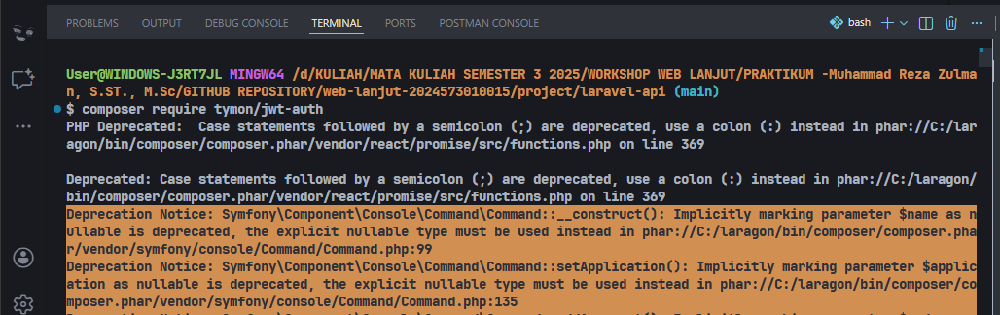
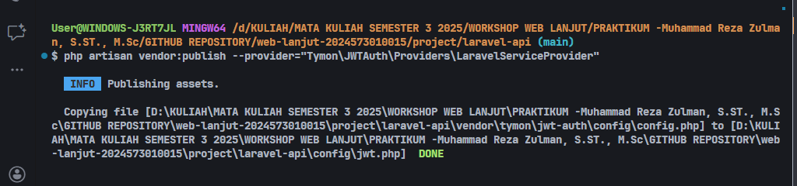
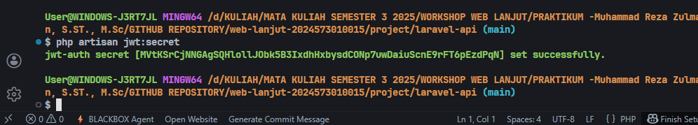
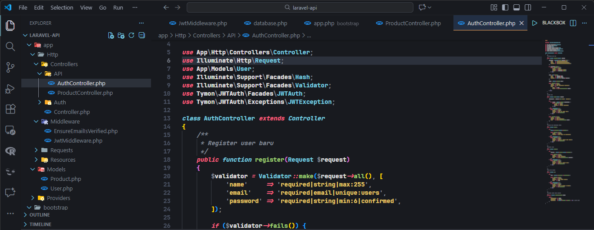
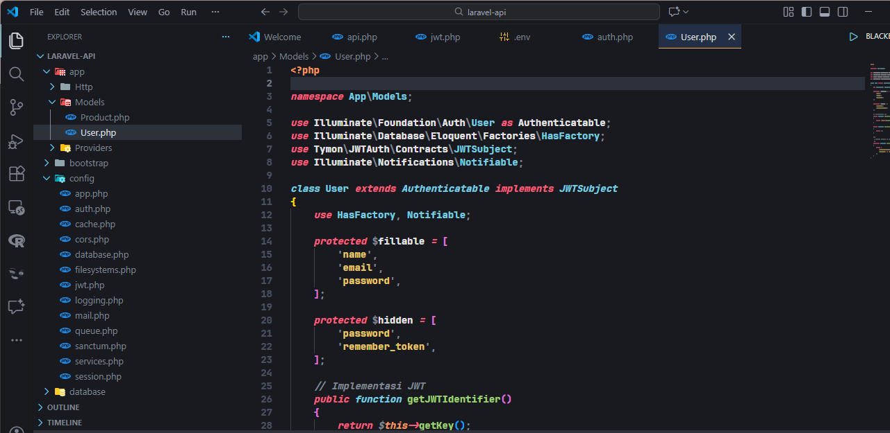
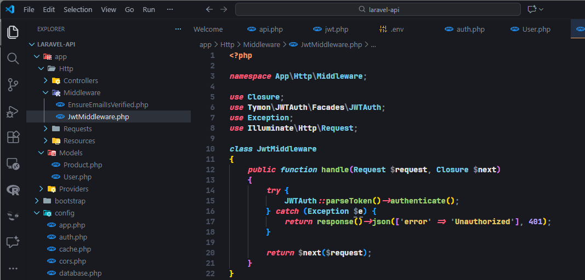
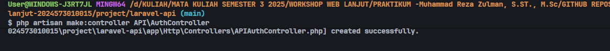
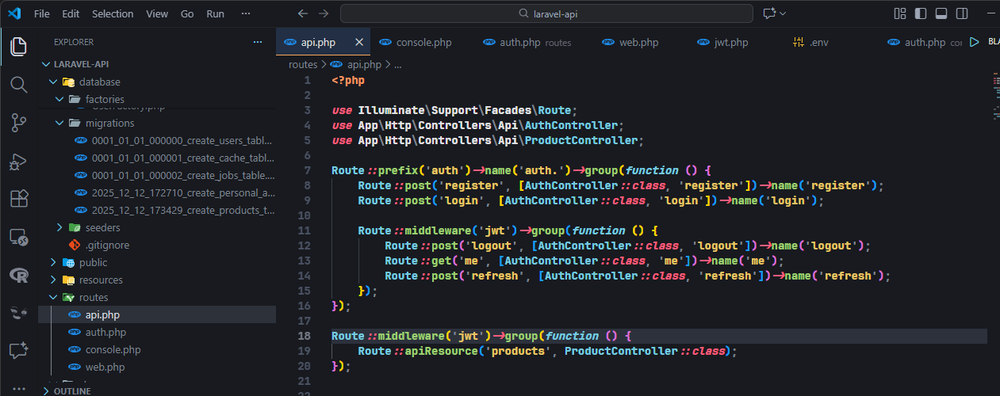
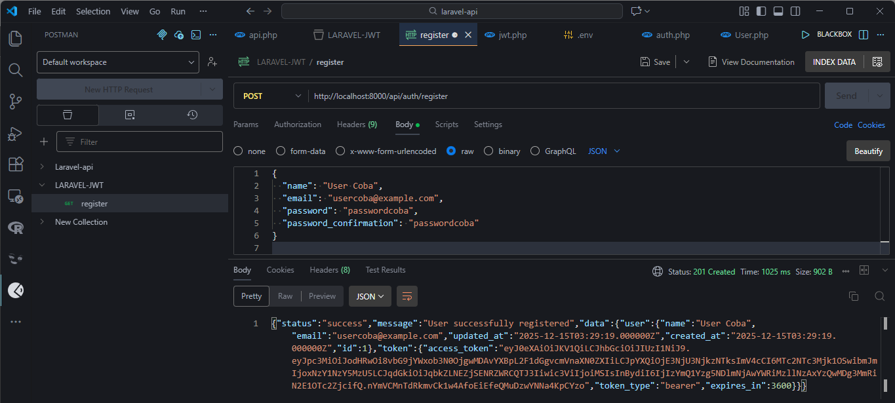

# Laporan Modul 10: Implementasi Autentikasi dan Otorisasi JWT pada Laravel 12

**Mata Kuliah:** Workshop Web Lanjut
**Nama:** Jelita Anggraini
**NIM:** 2024573010015
**Kelas:** TI-2C

---

## Abstrak

Laporan ini menguraikan penerapan mekanisme autentikasi dan otorisasi menggunakan JSON Web Token (JWT) pada RESTful API berbasis Laravel versi 12. Pembahasan meliputi pemasangan library JWT, pengaturan guard dan middleware, pembuatan endpoint registrasi dan login, pengamanan rute API, serta pengelolaan token seperti pembaruan dan penonaktifan token. Di akhir pembahasan, disediakan gambaran hasil implementasi sebagai referensi pembelajaran praktis.

---

## 1. Dasar Teori

Bagian ini menjelaskan konsep dasar keamanan API dengan JWT serta penerapannya pada Laravel 12.

### Autentikasi (Authentication)

**Pengertian**
Autentikasi merupakan proses verifikasi identitas pengguna untuk memastikan bahwa akses ke sistem dilakukan oleh pihak yang sah.

### JWT pada Laravel

* JWT adalah token berbentuk string yang dikirimkan melalui header `Authorization` dengan skema `Bearer`.
* Sistem tidak menyimpan sesi (sessionless), sehingga API bersifat stateless.
* Setelah proses login berhasil, server menghasilkan token yang berisi informasi pengguna (payload) dan mengirimkannya ke klien.

### Middleware Autentikasi

Middleware JWT berfungsi untuk:

* Mengecek keberadaan token pada request.
* Memvalidasi token (tanda tangan dan masa berlaku).
* Menolak request dengan respons *Unauthorized* apabila token tidak valid.

### JSON Web Token (JWT)

**Struktur Token**
JWT tersusun atas tiga bagian utama yang dipisahkan oleh tanda titik:

* Header: Menyimpan tipe token dan algoritma enkripsi.
* Payload: Menyimpan klaim atau data pengguna.
* Signature: Digunakan untuk memastikan integritas token.

**Alur Kerja JWT**

* Klien mengirimkan kredensial pengguna.
* Server memverifikasi data dan menghasilkan token.
* Token dikirim kembali ke klien.
* Setiap request selanjutnya wajib menyertakan token tersebut.

### Otorisasi (Authorization)

**Pengertian**
Otorisasi menentukan hak akses pengguna terhadap resource tertentu setelah proses autentikasi berhasil.

Pada Laravel dengan JWT:

* Otorisasi dilakukan setelah token dinyatakan valid.
* Rute API diamankan menggunakan middleware autentikasi.
* Hanya pengguna dengan token aktif yang dapat mengakses endpoint tertentu.

### Komponen Pendukung

* **Guard**: Menentukan metode autentikasi yang digunakan aplikasi.
* **Model User**: Mengimplementasikan kontrak JWT agar token dapat dibuat dan dibaca kembali.
* **Middleware JWT**: Menangani validasi token dan pengambilan data user dari token.

---

## 2. Langkah-Langkah Praktikum

Tahapan praktikum yang dilakukan pada modul ini meliputi:

1. Instalasi library JWT pada proyek Laravel 12.

2. Publikasi dan konfigurasi file JWT.

3. Pembuatan *secret key* untuk penandatanganan token.

4. Penyesuaian konfigurasi autentikasi pada file `auth.php`.

5. Modifikasi model User agar mendukung JWT.

6. Pembuatan dan pengaturan middleware JWT.
`1. MEMBUAT MIDDLEWARE`

`2. LOGIKA MIDDLEWARE`

7. Pembuatan controller autentikasi untuk proses registrasi dan login.

8. Pengaturan rute API yang dilindungi middleware.

9. Pengujian endpoint menggunakan browser dan Postman.

`POSTMAN REGISTER`

Setiap tahap dilengkapi dengan potongan kode dan tangkapan layar hasil pengujian untuk memastikan fungsi autentikasi berjalan dengan baik.

---

## 3. Hasil dan Pembahasan

### Hasil Praktikum

Hasil dari praktikum ini adalah sebuah RESTful API Laravel 12 yang telah dilengkapi sistem autentikasi JWT. Fitur yang berhasil diimplementasikan mencakup registrasi pengguna, login dengan token, pengamanan endpoint menggunakan middleware, serta pengujian akses API melalui Postman.

### Validasi dan Keamanan

Validasi input diterapkan pada proses registrasi dan login untuk memastikan data yang masuk sesuai ketentuan. Token JWT yang dihasilkan wajib disertakan pada setiap request ke endpoint yang dilindungi. Middleware akan memeriksa token tersebut sebelum memberikan akses, sehingga keamanan API tetap terjaga.

### Peran Komponen Sistem

* **Route**: Mendefinisikan endpoint publik dan endpoint yang dilindungi.
* **Controller**: Menangani logika autentikasi dan pengelolaan token.
* **Middleware**: Melakukan verifikasi token dan menolak request tidak sah.
* **Model User**: Menyimpan data pengguna dan menjadi sumber pembentukan token.

---

## 4. Kesimpulan

Penerapan JWT pada Laravel 12 memberikan solusi autentikasi yang aman dan efisien untuk pengembangan API modern. Dengan arsitektur stateless, sistem menjadi lebih fleksibel untuk digunakan pada aplikasi berbasis mobile maupun SPA. Implementasi ini dapat dikembangkan lebih lanjut dengan fitur otorisasi berbasis peran, pembatasan akses, dan peningkatan keamanan lainnya.

---

## 5. Referensi

* Laravel Documentation. *API Authentication*.
* Auth0. *JSON Web Token Handbook*.
* RFC 7519. *JSON Web Token (JWT) Standard*.
* Postman Learning Center. *API Testing Fundamentals*.
* OWASP Foundation. *API Security Best Practices*.
