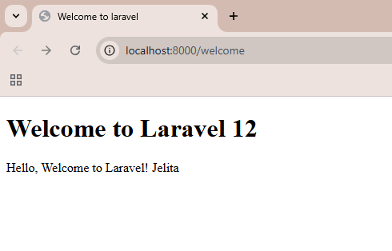
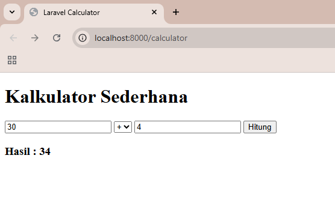
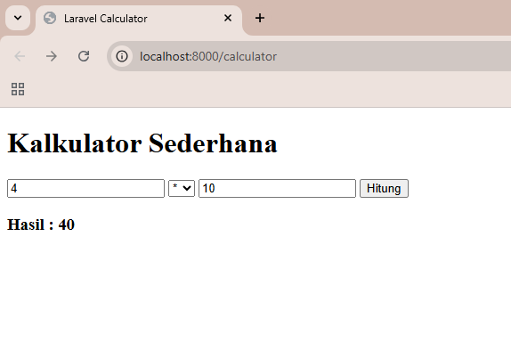

# Laporan Modul 2: Laravel Fundamentasl
**Mata Kuliah:** Workshop Web Lanjut   
**Nama:** Jelita Anggraini  
**NIM:** 2024573010015
**Kelas:** TI-2C 

---

## Abstrak 
Laporan ini akan membahas hasil praktikum pemrograman web menggunakan framework Laravel. Pada praktikum ini, diharapkan untuk mempelajari dasar penggunaan Laravel melalui pembuatan proyek helo-Laravel yang menampilkan pesan sederhana, serta proyek Kalkulator untuk memahami interaksi antara Route, Controller, dan View. Laporan  ini juga berisi analisis peran komponen MVC (Model-View-Controller) dan bagaimana data diproses dari pengguna hingga ditampilkan kembali ke browser.

### Tujuan
Tujuan laporan ini adalah untuk mendokumentasikan proses praktikum dan juga sebagai tugas pada Mata kuliah workshop Web Lanjut, serta memahami cara kerja Laravel dalam menangani Request dan Response, juga melatih kemampuan dalam mengimplementasikan konsep MVC melalui contoh sederhana. Dengan laporan ini, diharapkan agar mahasiswa lebih mudah memahami alur kerja Laravel dan mampu mengembangkan aplikasi web yang lebih kompleks di masa mendatang.

---

## 1. Dasar Teori
### Apa Itu MVC (Model, View, Controller)
Model View Controller atau yang dapat disingkat MVC adalah sebuah pola arsitektur dalam membuat sebuah aplikasi dengan cara memisahkan kode menjadi tiga bagian yang terdiri dari:

- Model
Bagian yang bertugas untuk menyiapkan, mengatur, memanipulasi, dan mengorganisasikan data yang ada di database.

- View
Bagian yang bertugas untuk menampilkan informasi dalam bentuk Graphical User Interface (GUI).

- Controller
Bagian yang bertugas untuk menghubungkan serta mengatur model dan view agar dapat saling terhubung.

### Konsep Routing di Laravel
Routing di Laravel adalah proses penentuan bagaimana sebuah aplikasi menanggapi permintaan HTTP ke alamat tertentu (URL). Setiap route dapat diarahkan ke sebuah closure atau controller tertentu, menentukan logika yang akan dieksekusi ketika URL tersebut diakses.

Cara kerjanya yaitu :

Sistem routing Laravel bekerja dengan cara yang sangat deklaratif dan terpusat, biasanya didefinisikan dalam file *routes/web.php* dan *routes/api.php*. Ketika sebuah permintaan masuk, Laravel akan memeriksa URL yang diminta dan mencocokkannya dengan route yang telah Anda definisikan.

Misalnya, saat pengguna mengakses https://contoh.com/about-us, Laravel akan mencari route yang terdaftar untuk URL /about-us. Ketika ditemukan, route tersebut akan mengeksekusi fungsi atau metode controller yang telah ditentukan, yang kemudian akan mengembalikan respons (misalnya, menampilkan halaman "Tentang Kami").

Berikut contoh route sederhana yang mengembalikan string saat diakses:
```
use Illuminate\Support\Facades\Route;

Route::get('/', function () {
    return 'Hello, Laravel!';
});

```
Berikut contoh cara mendefinisikan route dengan parameter:
```
Route::get('/user/{id}', function ($id) {
    return "User ID: " . $id;
});

```
### Fungsi Middleware.

Fungsi middleware adalah untuk memproses permintaan HTTP sebelum mencapai aplikasi utama atau controller, dan memproses respons HTTP sebelum dikirim kembali ke pengguna. Middleware bertindak seperti "penjaga gerbang" yang bisa memeriksa, memodifikasi, atau bahkan menolak permintaan yang masuk.

Beberapa penggunaan umum middleware di Laravel adalah:
1. Authentication (auth)
2. Logging
3. CORS
4. Input sanitization

### Bagaimana cara Laravel menangani Request dan Response.

Laravel menangani Request (permintaan) dan Response (tanggapan) melalui sebuah siklus hidup aplikasi yang terorganisir. Proses ini dimulai ketika sebuah permintaan HTTP masuk ke aplikasi dan diakhiri ketika sebuah tanggapan dikirim kembali ke browser. Inti dari proses ini adalah Kernel HTTP yang mengelola seluruh alur kerja.

* Menerima Request
Ketika sebuah permintaan masuk, Laravel akan menerimanya melalui file public/index.php. File ini adalah titik masuk tunggal (single entry point) untuk semua permintaan. index.php akan memuat Kernel HTTP yang bertugas mengendalikan seluruh proses.
Kernel HTTP (terletak di app/Http/Kernel.php) berfungsi sebagai "koordinator" utama yang menerima permintaan masuk. Kernel akan memproses permintaan tersebut melalui serangkaian middleware yang berfungsi sebagai "filter". Middleware dapat digunakan untuk melakukan otentikasi, penanganan CORS, atau mengelola sesi.

* Membuat dan Mengirim Response
Setelah logika di Controller selesai, Laravel akan menghasilkan sebuah Response. Response ini bisa berupa:
- View: Mengembalikan tampilan HTML.
- JSON: Mengembalikan data dalam format JSON, ideal untuk API.
- Redirect: Mengalihkan pengguna ke URL lain.
Setelah respons dibuat, ia akan melewati middleware lagi (dalam urutan terbalik). Middleware ini dapat digunakan untuk memodifikasi header respons, menambahkan cookie, atau melakukan kompresi. Terakhir, Kernel HTTP akan mengirimkan respons akhir kembali ke browser pengguna.

### Peran Controller dan View
* Controller berperan sebagai Bagian yang bertugas untuk menghubungkan serta mengatur model dan view agar dapat saling terhubung.
* View berperan sebagai Bagian yang bertugas untuk menampilkan informasi dalam bentuk Graphical User Interface (GUI).

### Fungsi Blade Templating Engine
Pada framework Laravel, dikenal istilah blade templating yang berfungsi sebagai default template. Blade templating adalah sistem template bawaan dari Laravel yang digunakan untuk membuat tampilan web dengan cara yang lebih rapi dan terstruktur.

Dengan Blade, kita bisa membuat bagian-bagian dari halaman web, seperti header atau footer, yang bisa digunakan kembali di banyak halaman tanpa perlu menulis ulang kode. Tentunya, hal ini membuat proses pengembangan web lebih cepat dan mudah.

Blade juga menyediakan fitur sederhana untuk menggabungkan logika PHP dengan HTML, seperti menampilkan data dari database atau memeriksa kondisi tertentu, menggunakan sintaks yang mudah dibaca dan dipahami.

---

## 2. Langkah-Langkah Praktikum
Tuliskan langkah-langkah yang sudah dilakukan, sertakan potongan kode dan screenshot hasil.

### 2.1 Praktikum 1 – Route, Controller, dan Blade View

* Langkah 1 : Tambahkan route pada routes/web.php
    - Buka file routes/web.php dan edit kodenya menjadi seperti berikut :
```
    <?php

    use Illuminate\Support\Facades\Route;
    use App\Http\Controllers\WelcomeController;

    Route::get('/', function () {
        return view('welcome');
    });

    Route::get('/welcome', [WelcomeController::class, 'show']);

    ?>

```
* Langkah 2 : Buat controller WelcomeController.
    - caranya dengan mengetikkan perintah berikut ke terminal(git bash) sesuai dengan alamat project yang akan dibuat contohnya seperti :
```
User@WINDOWS-J3RT7JL MINGW64 /d/KULIAH/MATA KULIAH SEMESTER 3 2025/WORKSHOP WEB LANJUT/PRAKTIKUM -Muhammad Reza Zulman, S.ST., M.Sc/GITHUB REPOSITORY/web-lanjut-2024573010015/project/helo-laravel (main)
$ php artisan make:controller WelcomeController

```
Buka file yang sudah dibuat tadi pada _app/http/controllers/welcomeController.php_ kemudian edit jadi seperti ini :
```
<?php

namespace App\Http\Controllers;

use Illuminate\Http\Request;

class WelcomeController extends Controller
{
    public function show(){
        $message = "Welcome to Laravel! Jelita";
        return view('mywelcome', ['message' => $message]);
    }
}

```
* Langkah 3 : Buat view mywelcome.blade.php.
    - buat file baru pada _resources/views/mywelcome.php_ kemudian isi code menjadi seperti ini :
```
    <!DOCTYPE html>
    <html lang="en">
    <head>
        <meta charset="UTF-8">
        <meta name="viewport" content="width=device-width, initial-scale=1.0">
        <meta http-equiv="X-UA-Compatible" content="ie=edge">
        <title>Welcome to laravel</title>
    </head>
    <body>
        <h1>
            Welcome to Laravel 12
        </h1>
        <p>
            Hello, {{$message}}
        </p>
    </body>
    </html>

```
* Langkah 4 : Jalankan aplikasi dan tunjukkan hasil di browser.
- jalankan project laravel dengan perintah ini di terminal:`
```
    User@WINDOWS-J3RT7JL MINGW64 /d/KULIAH/MATA KULIAH SEMESTER 3 2025/WORKSHOP WEB LANJUT/PRAKTIKUM -Muhammad Reza Zulman, S.ST., M.Sc/GITHUB REPOSITORY/web-lanjut-2024573010015/project/helo-laravel (main)
    $ php artisan serve

```
- kemudian sebelum membuka browser aktifkan xampp lalu buka browser dan ketik di pencarian seperti berikut :

```
    http:localhost:8000/welcome

```

### Berikut adalah hasil dari praktikum 1:


### 2.2 Praktikum 2 – Membuat Aplikasi Sederhana "Calculator"

* Langkah 1 : Tambahkan route untuk kalkulator.
- yaitu dengan membuka file pada routes/web.php kemudian tambahkan 2 route berikut :
```
    use App\Http\Controllers\CalculatorController;

    Route::get('/calculator', [CalculatorController::class, 'index']);
    Route::post('/calculator', [CalculatorController::class, 'calculate'])->name('calculator.calculate');

```
- route pertama menampilkan form kalkulator
- route kedua memproses data dari form.

* Langkah 2 : Buat controller CalculatorController.
- cara membuat controller baru yaitu dengan mengetikkan perintah berikut di terminal(gitbash) di alamat project yang akan dibuat contoh seperti :       
```
User@WINDOWS-J3RT7JL MINGW64 /d/KULIAH/MATA KULIAH SEMESTER 3 2025/WORKSHOP WEB LANJUT/PRAKTIKUM -Muhammad Reza Zulman, S.ST., M.Sc/GITHUB REPOSITORY/web-lanjut-2024573010015/projects/calculator (main)
$ php artisan make:controller CalculatorController

```
- Kemudian buka file yang baru dibuat tadi pada  app/Http/Controllers/CalculatorController.php dan ubah code jadi seperti berikut :
```
    <?php

    namespace App\Http\Controllers;

    use Illuminate\Http\Request;

    class CalculatorController extends Controller
    {
        public function index(){
            return view('calculator');
        }

        public function calculate(Request $request) {
            $validated = $request->validate([
                'number1' => 'required|numeric',
                'number2' => 'required|numeric',
                'operator' => 'required|in:add,sub,mul,div'
            ]);

            $result = match ($validated['operator']) {
                'add' => $validated['number1'] + $validated['number2'],
                'sub' => $validated['number1'] - $validated['number2'], 
                'mul' => $validated['number1'] * $validated['number2'], 
                'div' => $validated['number2'] != 0 ? ($validated['number1'] / $validated['number2']) : 'Error: Division by 0',
            };

            return view('calculator', [
                'result' => $result,
                'number1' => $validated['number1'],
                'number2' => $validated['number1'],
                'operator' => $validated['operator'],
            ]);
        }
    }


```
* Langkah 3 : Tambahkan view calculator.blade.php.
- ubah file pada resources/views/calculator.blade.php dengan isi sebagai berikut:
```
    <!DOCTYPE html>
    <html>
    <head>
        <title>Laravel Calculator</title>
    </head>
    <body>
        <h1>Kalkulator Sederhana</h1>

        @if ($errors->any())
            <div style="color: red;">
                <ul>
                    @foreach ($errors->all() as $error)
                        <li>{{ $error }}</li>
                    @endforeach
                </ul>
            </div>
        @endif

        <form method="POST" action="{{ route('calculator.calculate') }}">
            @csrf
            <input type="number" name="number1" value="{{ old('number1', $number1 ?? '') }}" placeholder="Angka pertama" required>

            <select name="operator" required>
                <option value="add" {{ ($operator ?? '') == 'add' ? 'selected' : '' }}>+</option>
                <option value="sub" {{ ($operator ?? '') == 'sub' ? 'selected' : '' }}>-</option>
                <option value="mul" {{ ($operator ?? '') == 'mul' ? 'selected' : '' }}>*</option>
                <option value="div" {{ ($operator ?? '') == 'div' ? 'selected' : '' }}>/</option>
            </select>

            <input type="number" name="number2" value="{{ old('number2', $number2 ?? '') }}" placeholder="Angka kedua" required>
            <button type="submit">Hitung</button>
        </form>

        @isset($result)
            <h3>Hasil : {{ $result }}</h3>
        @endisset
    </body>
    </html>

```
- Jalankan aplikasi dan coba dengan beberapa input berbeda.
- jalankan project laravel dengan perintah ini di terminal:
```
    User@WINDOWS-J3RT7JL MINGW64 /d/KULIAH/MATA KULIAH SEMESTER 3 2025/WORKSHOP WEB LANJUT/PRAKTIKUM -Muhammad Reza Zulman, S.ST., M.Sc/GITHUB REPOSITORY/web-lanjut-2024573010015/projects/calculator (main)
    $ php artisan serve

```
- kemudian sebelum membuka browser aktifkan xampp lalu buka browser dan ketik di pencarian seperti berikut :
```
    http:localhost:8000/calculator

```

Berikut adalah hasil dari praktikum 2
* inputan 1 :



* inputan 2 :



---

## 3. Hasil dan Pembahasan
1. Apakah aplikasi berjalan sesuai harapan? 
JAWAB : YA, menurut saya aplikasi sudah berjalan sesuai harapan saya
2. Apa yang terjadi jika ada input yang salah (misalnya pembagian dengan 0)?
JAWAB : Saat saya mencoba untuk melakukan pembagian dengan 0. muncul hasil error seperti berikut:
```
Hasil : Error: Division by 0

```
3. Bagaimana validasi input bekerja di Laravel?
JAWAB : Di Laravel, validasi input digunakan untuk memastikan data yang dikirimkan oleh user sesuai dengan aturan yang kita tentukan (misalnya wajib diisi, harus berupa email, panjang minimal, dsb). Mekanismenya kira-kira seperti ini:
- User mengirim data melalui form atau request (POST/GET).
- Laravel memeriksa data sesuai aturan validasi yang kita definisikan.
- Jika data valid → proses dilanjutkan (misalnya disimpan ke database).
- Jika data tidak valid → Laravel otomatis mengembalikan response berisi pesan error, biasanya kembali ke halaman form dengan pesan kesalahan.

4. Apa peran masing-masing komponen (Route, Controller, View) dalam program yang dibuat?

JAWAB : 
1. Route adalah “pintu masuk” aplikasi Laravel.
- Tugasnya: Menentukan URL mana yang bisa diakses user, lalu diarahkan ke Controller atau langsung ke View.
contoh berdasarkan program saya yaitu :
```
Route::get('/welcome', [WelcomeController::class, 'show']);

```
Saat user membuka /welcome, Laravel tahu harus menjalankan method show di WelcomeController.

2. Controller Sebagai “otak” atau penghubung antara Route dan View.
- Tugasnya: Mengolah request dari Route, menjalankan logika (misalnya ambil data, validasi, dll), lalu mengirim data ke View.contoh berdasarkan program saya yaitu :
```
public function show(){
    $message = "Welcome to Laravel! Jelita";
    return view('mywelcome', ['message' => $message]);
}

```
Controller membuat variabel $message, lalu mengirimkannya ke View.

3. View Sebagai tampilan (user interface).
- fungsinya Menampilkan data yang dikirim Controller dalam bentuk HTML.contoh berdasarkan program saya yaitu :

```
<h1>Welcome to Laravel 12</h1>
<p>Hello, {{$message}}</p>

```
- View akan menampilkan pesan statis “Welcome to Laravel 12” dan pesan dinamis dari variabel $message.

---

## 4. Kesimpulan

Melalui praktikum ini, saya jadi lebih memahami cara kerja Laravel dengan konsep MVC, yaitu Route sebagai penghubung URL, Controller untuk logika aplikasi, dan View untuk tampilan. Pada project Hello Laravel dan juga project Kalkulator, dengan pemahaaman serta latihan dari praktikum ini saya berhasil membuat sebuah aplikasi sederhana yang menampilkan data dan memproses input, juga semakin paham alur request–response di Laravel.

---

## 5. Referensi
Blog Dicoding - https://www.dicoding.com/blog/apa-itu-mvc-pahami-konsepnya/
Medium - https://medium.com/@_azwar/artikel-memahami-cara-kerja-routing-di-laravel-bagian-1-5050f6d90cb7
ID Laravel - id-laravel.com/post/middleware-manfaat-dan-penggunaannya/
Laravel - https://laravel.com/docs/11.x/requests
Laravel - https://laravel.com/docs/11.x/response
rumahWeb - https://www.rumahweb.com/journal/belajar-laravel-bagian-4/

---
