# Laporan Modul 3: Laravel Controller

**Mata Kuliah:** Workshop Web Lanjut
**Nama:** Jelita Anggraini
**NIM:** 2024573010015
**Kelas:** TI-2C

---

## Abstrak

Laporan ini mendokumentasikan hasil praktikum Modul 3 yang membahas *Controller* pada framework Laravel 12. Praktikum berfokus pada peran controller dalam pola arsitektur MVC, jenis-jenis controller (basic, resource, invokable), teknik pengelompokan rute, injeksi permintaan dan injeksi ketergantungan, validasi request, serta cara mengembalikan berbagai jenis respons (view, JSON, redirect, respons kustom). Selain itu dilaksanakan tiga latihan praktikum untuk menerapkan konsep penerusan data dari controller ke Blade view, pengelompokan rute, dan pengelompokan rute menggunakan prefix/namespace untuk area admin.

## Tujuan

1. Memahami peran Controller dalam arsitektur MVC Laravel.
2. Mempelajari cara membuat berbagai jenis controller dan mendaftarkan rute yang sesuai.
3. Menerapkan teknik pengelompokan rute (Route::controller, Route::resource, prefix/namespace).
4. Mengimplementasikan validasi, injeksi dependensi, serta mengembalikan berbagai jenis respons dari controller.
5. Mendokumentasikan langkah-langkah praktikum dan hasil pengujian.

## Dasar Teori

### Apa itu Controller?

Controller adalah komponen dalam framework Laravel yang bertanggung jawab untuk menangani logika aplikasi. Ia berfungsi sebagai "jembatan" antara routing dan bagian lain dari aplikasi, seperti model dan view. Dengan menggunakan controller dapat memisahkan logika aplikasi dari kode yang mengatur tampilan (view), sehingga struktur kode menjadi lebih rapi, mudah dikelola, dan bersifat modular.

### Jenis-jenis Controller di Laravel

* **Basic Controller**: controller standar dengan beberapa metode untuk berbagai endpoint.
* **Resource Controller**: dibuat dengan `--resource` untuk operasi CRUD (index, create, store, show, edit, update, destroy).
* **Invokable Controller**: controller dengan satu aksi (metode `__invoke`) cocok untuk tugas yang hanya membutuhkan satu metode.Contohnya, menghitung total diskon atau mengirim email.

### Pengelompokan Rute

Laravel menyediakan cara mengelompokkan rute supaya definisi rute lebih rapi:

* `Route::controller(Controller::class)->group(...)` untuk mengikat beberapa rute ke satu controller.
* `Route::resource(...)` untuk resourceful routing.
* Pengelompokan dengan `prefix` dan namespace (mis. `Route::prefix('admin')->group(...)`) untuk memisahkan area seperti panel admin.

### Injeksi Dependensi & Validasi

Laravel mendukung injeksi dependensi pada metode controller (mis. `Request` atau layanan lain). Validasi dapat dilakukan langsung di controller menggunakan `$request->validate([...])` atau lebih bersih menggunakan *Form Request* yang dibuat dengan Artisan (`php artisan make:request StoreUserRequest`).

### Tipe Respons dari Controller

Controller dapat mengembalikan:

* **View**: `return view('home', compact('data'));`
* **JSON**: `return response()->json([...]);`X
* **Redirect**: `return redirect()->route('home');`
* **Response kustom**: `return response('OK', 200)->header('Content-Type', 'text/plain');`

## Langkah-Langkah Praktikum

### Praktikum 1 — Menangani Request dan Response (View)

1. Buat dan buka proyek baru, disini saya buat proyek baru bernama lab-view menggunakan composer:

   ```bash
   composer create-project laravel/laravel:^12.0.3 lab-view
   cd lab-view
   code .
   ```
2. Buat controller DemoController:

   ```bash
   php artisan make:controller DemoController
   ```
3. Tambahkan metode pada `app/Http/Controllers/DemoController. Seperti berikut:
```
   namespace App\Http\Controllers;
   use Illuminate\Http\Request;

   class DemoController extends Controller {
      // Simple data passing
      public function hello() {
         $name = 'Laravel Learner';
         return view('greet', ['name' => $name]);
      }
      // Parameterized route
      public function greet($name) {
         return view('greet', ['name' =>ucfirst($name)]);
      }
      // Query String
      public function search(Request $request) {
         $keyword = $request->query('q', 'none');
         return view('search', ['keyword' => $keyword]);
      }

   }

```
4. Daftarkan rute pada `routes/web.php`:

   ```<?php
   use App\Http\Controllers\DemoController;
   Route::get('/hello', [DemoController::class, 'hello']);
   Route::get('/greet/{name}', [DemoController::class, 'greet']);
   Route::get('/search', [DemoController::class, 'search']);
   ```
5. Buat view Blade sederhana di `resources/views/` (hello.blade.php, greet.blade.php, search.blade.php) yang menerima dan menampilkan data.
6. Jalankan server: `php artisan serve` dan uji endpoint: `/hello`, `/greet/thariq`, `/search?q=laravel`.

**Hasil**: Data berhasil diteruskan dari controller ke view; route parameter dan query string terbaca sesuai yang diharapkan.

**Berikut adalah tampilan hasil dari praktikum 1 :**
/hello :
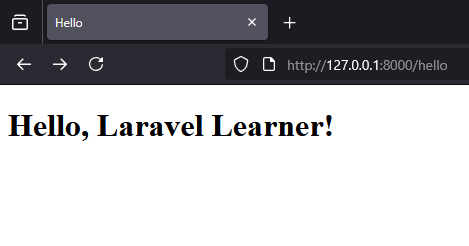

/greet/jelita :
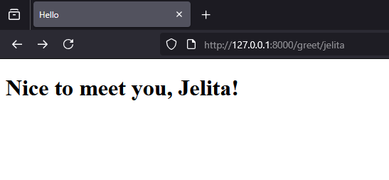

/search?q=laravel
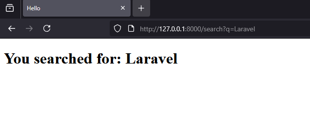

### Praktikum 2 — Menggunakan Group Route

1. Buat dan buka proyek baru, disini saya buat proyek baru bernama lab-group menggunakan composer.Buka terminal dan jalankan:

   ```bash
   composer create-project laravel/laravel:^12.0.3 lab-group
   cd lab-group
   code .

   ```
2. Buat sebuah controller PageController dengan beberapa metode: `home()`, `about()`, `contact()`.

   ```bash
   php artisan make:controller PageController
   ```
   setelah itu perbarui controller app/Http/Controllers/PageController.php:
   <?php
   ```
      namespace App\Http\Controllers;

      class PageController extends Controller
      {
         public function home() {
            $message = "Welcome to the homepage.";
            return view('pages.home', compact('message'));
         }

         public function about(){
            $message = "This is the about page.";
            return view('pages.about', compact('message'));
         }

         public function contact(){
            $message = "Reach us through the contact page.";
            return view('pages.contact', compact('message'));
         }
      }

   ```
3. Definisikan pengelompokan rute:
Buka routes/web.php dan definisikan kelompok rute:

   ```<?php
   use Illuminate\Support\Facades\Route;
   use      App\Http\Controllers\PageController;

   Route::controller(PageController::class)->group(function () {
       Route::get('/','home');
       Route::get('/about','about');
       Route::get('/contact','contact');
   });
   ```
3. Buat file view di `resources/views/pages/` untuk masing-masing metode.
1. home.blade.php:
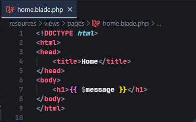
2. about.blade.php:
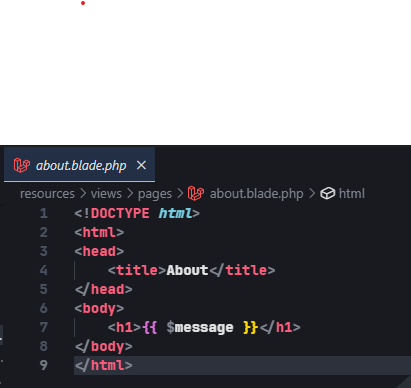
3. contact.blade.php:
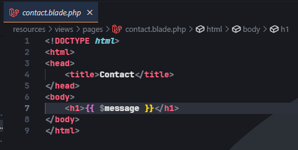

4. Jalankan server: `php artisan serve` dan uji endpoint: `http://127.0.0.1:8000/ -> Home`, `http://127.0.0.1:8000/about -> About`, `http://127.0.0.1:8000/contact -> Contact`.

**Hasil**: Kelompok rute bekerja, kode rute menjadi lebih ringkas dan terstruktur.

**Berikut adalah tampilan hasil dari praktikum 2 :**
http://127.0.0.1:8000/ 
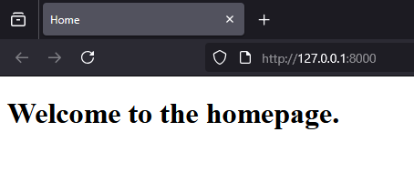

http://127.0.0.1:8000/about
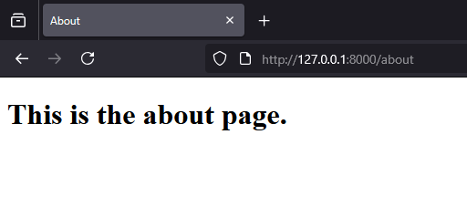

http://127.0.0.1:8000/contact
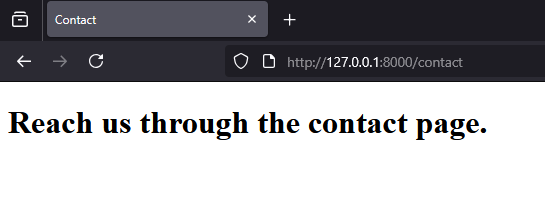

### Praktikum 3 — Pengelompokan Prefix dengan Namespace

1. Buat dan buka proyek baru, disini saya buat proyek baru bernama lab-prefix menggunakan composer.Buka terminal dan jalankan:

   ```bash
   composer create-project laravel/laravel:^12.0.3 lab-prefix
   cd lab-prefix
   code .

   ```

2. Buat subfolder controller `Admin` dan controller `DashboardController`, `UserController`:

   ```bash
   php artisan make:controller Admin/DashboardController
   php artisan make:controller Admin/UserController
   ```
   Ini akan membuat dua controller di direktori app/Http/Controllers/Admin/:

   - app/Http/Controllers/Admin/DashboardController.php
   - app/Http/Controllers/Admin/UserController.php

3. Definisikan rute dengan prefix dan namespace controller:

   ```php
   use Illuminate\Support\Facades\Route;
   use App\Http\Controllers\Admin\DashboardController;
   use App\Http\Controllers\Admin\UserController;

   Route::prefix('admin')->group(function () {
    Route::get('/dashboard', [DashboardController::class, 'index'])->name('admin.dashboard'); 
    Route::get('/users', [UserController::class, 'index'])->name('admin.users'); 
    Route::get('/users/{id}', [UserController::class, 'show'])->name('admin.users.show');         
   });
   ```
4. Tambahkan Aksi ke Controller 
Membuat aksi sederhana yang akan mengembalikan view dengan pesan selamat datang di /DashboardController.php:

```php
   namespace App\Http\Controllers\Admin;

   use App\Http\Controllers\Controller;

   class DashboardController extends Controller
   {
      public function index() {
         return view('admin.dashboard', ['message' => 'welcome to Admin Dshboard']);
      }
   }
```
membuat aksi sederhana yang mengembalikan daftar pengguna. Berikut kode untuk UserController.php:
```php

   namespace App\Http\Controllers\Admin;

   use App\Http\Controllers\Controller;

   class UserController extends Controller 
   {
      public function index() {
         $users = ['Ria', 'Lie', 'Jon'];
         return view('admin.users.index', compact('users'));
      }

      public function show($id) {
         $user = "User #" . $id;
         return view('admin.users.show', compact('user'));
      }

   }
```
5. Buat view di `resources/views/admin/` seperti `dashboard.blade.php` dan `users/index.blade.php`.

- dashboard.blade.php didalam folder resources/views/admin/

```<!DOCTYPE html>
   <html>
   <head>
      <title>Admin Dashboard</title>
   </head>
   <body>
      <h1>{{ $message }}</h1>
   </body>
   </html>
```
- index.blade.php didalam folder users yang berada didalam resources/views/admin/

```<!DOCTYPE html>
   <html>
   <head>
      <title>Users</title>
   </head>
   <body>
      <h1>User List</h1>
      <ul>
         @foreach ($users as $user)
               <li>{{ $user }}</li>
         @endforeach
      </ul>
   </body>
   </html>
```
- show.blade.php berada di folder yang sama di dalam folder users.
```<!DOCTYPE html>
   <html>
   <head>
      <title>Admin Dashboard</title>
   </head>
   <body>
      <h1>{{ $message }}</h1>
   </body>
   </html>
```

5. Jalankan server: `php artisan serve` dan uji endpoint: `http://127.0.0.1:8000/admin/dashboard`, `http://127.0.0.1:8000/admin/users`, `http://127.0.0.1:8000/admin/users/2`.

**Hasil**: Prefix dan struktur namespace memudahkan pemisahan area fitur (mis. panel admin).

**Berikut adalah tampilan hasil dari praktikum 3 :**
http://127.0.0.1:8000/admin/dashboard 
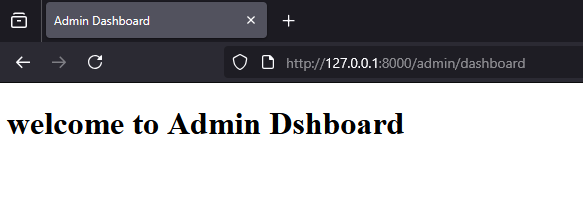

http://127.0.0.1:8000/admin/users
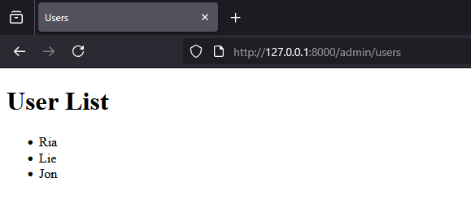

http://127.0.0.1:8000/admin/users/2
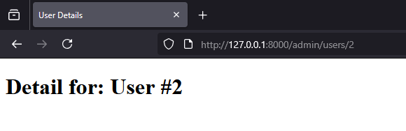

## Hasil dan Pembahasan

1. **Apakah semua praktik berjalan sesuai harapan?**
   Ya — controller dapat meneruskan data ke view, rute parameter dan query string terbaca, pengelompokan rute dan prefix/namespace bekerja dengan baik.

2. **Bagaimana validasi dan penanganan input dilakukan?**
   Pada contoh sederhana, validasi bisa dilakukan menggunakan `$request->validate([...])`. Untuk skenario lebih kompleks disarankan menggunakan Form Request agar controller tetap bersih.

3. **Manfaat pengelompokan rute dan namespace**:

   * Mengurangi pengulangan definisi rute.
   * Mempermudah pemeliharaan saat aplikasi bertambah besar (mis. memisah area admin).
   * Membuat struktur proyek lebih jelas dan konsisten.

4. **Hal yang dipelajari**:

   * Peran Controller sebagai perantara logika aplikasi.
   * Cara membuat resource dan invokable controller untuk pola yang berbeda.
   * Teknik meneruskan data ke Blade dan mengembalikan tipe respons berbeda.

## Kesimpulan

Modul 3 memperkuat pemahaman mengenai bagaimana controller berfungsi dalam Laravel 12: menerima request, memvalidasi dan memproses data, serta mengembalikan respons. Penggunaan resource controller, invokable controller, dan teknik pengelompokan rute (controller group, prefix/namespace) membantu menulis kode yang lebih terstruktur dan mudah dipelihara.

## Referensi

* Modul praktikum: "Modul 3 - Laravel Controller" (panduan praktikum).
* Artikel belajar controller: https://buildwithangga.com/tips/apa-itu-controller-pada-laravel
* Dokumentasi resmi Laravel (Laravel 12) — untuk referensi lebih lanjut tentang routing, controller, dan request/response.

---
