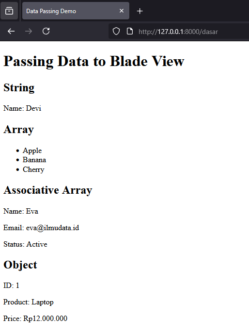
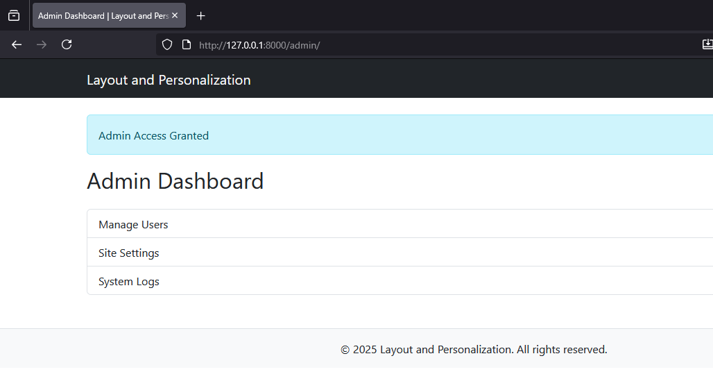
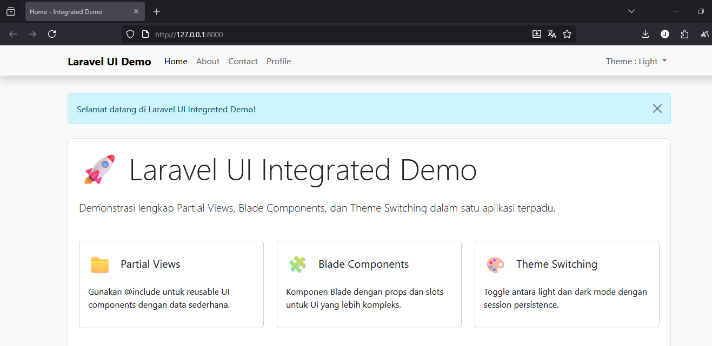
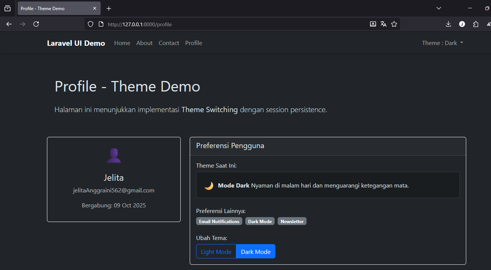

# Laporan Modul 4: Laravel Blade Template Engine

**Mata Kuliah:** Workshop Web Lanjut
**Nama:** Jelita Anggraini
**NIM:** 2024573010015
**Kelas:** TI-2C

---

## Abstrak

Laporan ini membahas praktik penggunaan **Blade** — mesin templating bawaan Laravel untuk membuat *view* yang bersih, terstruktur, dan dapat digunakan ulang. Praktikum meliputi penerusan data dari controller ke Blade, penggunaan struktur kontrol, serta pembuatan layout dan komponen yang dapat digunakan kembali. Tujuan praktikum adalah memahami cara kerja Blade dan menerapkannya pada contoh sederhana.

## Tujuan

1. Memahami sintaks dasar dan direktif Blade.
2. Mampu meneruskan berbagai tipe data dari Controller ke View.
3. Mengaplikasikan struktur kontrol Blade (`@if`, `@foreach`, `@switch`, dll).
4. Membangun *layout* dengan `@extends` / `@yield` dan *reusable components/includes*.

---

## 1. Dasar Teori

### Apa itu Blade

**Blade** adalah mesin templating Laravel yang sederhana dan powerful. Blade memungkinkan penulisan template menggunakan sintaks yang bersih (misalnya `{{ }}`) dan menyediakan direktif untuk kontrol alur, *inclusion*, *inheritance*, dan *components*. Blade adalah salah satu fitur dalam laravel yang digunakan untuk menampilkan output pada view. Fitur blade ini bisa dibilang sangat canggih, karena kita dapat membuat coding tanpa perlu tag PHP (<?php ?>). Selain menampilkan output, blade juga digunakan untuk membuat layout website.

### Direktif Umum

* `{{ $variable }}` — menampilkan isi variabel (escaped).
* `{!! $html !!}` — menampilkan HTML tanpa escaping.
* `@if`, `@elseif`, `@else`, `@endif` — kondisi.
* `@foreach`, `@endforeach` — perulangan.
* `@include('partial')` — menyertakan *partial view*.
* `@extends('layouts.app')` dan `@yield('content')` — *inheritance layout*.
* `@component` / `<x-component>` — *blade components*.

### Best Practice

* Hindari menaruh logika bisnis di view.
* Gunakan layout dan component agar DRY (*Don't Repeat Yourself*).
* Kelompokkan view berdasarkan fitur/domain.

---

## 2. Langkah-Langkah Praktikum

Berikut ringkasan langkah praktikum berdasarkan modul.

### Praktikum 1 — Meneruskan Data dari Controller ke Blade View

**Tujuan:** Menunjukkan cara meneruskan tipe data (string, array, associative array, object) dari controller ke view.

**Langkah singkat:**

1. Buat project Laravel baru, misalnya `modul-4-blade-view`menggunakan composer dengan membuka terminal dan jalankan :
```laravel new modul-4-blade-view
    cd modul-4-blade-view
    code .

```
2. Buat controller:

   ```bash
   php artisan make:controller DasarBladeController
   ```
3. Tambahkan route di `routes/web.php`:

   ```php
   use App\Http\Controllers\DasarBladeController;
   Route::get('/dasar', [DasarBladeController::class, 'showData']);
   ```
4. Implementasi method di controller:

   ```php
   public function showData() {
       $name = 'Devi';
       $fruits = ['Apple', 'Banana', 'Cherry'];
       $user = [ 'name' => 'Eva', 'email' => 'eva@ilmudata.id', 'is_active' => true ];
       $product = (object) [ 'id' => 1, 'name' => 'Laptop', 'price' => 12000000 ];
       return view('dasar', compact('name','fruits','user','product'));
   }
   ```
5. Buat file baru di `resources/views/dasar.blade.php` untuk menampilkan variabel menggunakan Blade, tambahkan :
```<!DOCTYPE html>
    <html>
    <head>
        <title>Data Passing Demo</title>
    </head>
    <body>
        <h1>Passing Data to Blade View</h1>
        
        <h2>String</h2>
        <p>Name: {{ $name }}</p>
        
        <h2>Array</h2>
        <ul>
            @foreach ($fruits as $fruit)
                <li>{{ $fruit }}</li>
            @endforeach
        </ul>
        
        <h2>Associative Array</h2>
        <p>Name: {{ $user['name'] }}</p>
        <p>Email: {{ $user['email'] }}</p>
        <p>Status: {{ $user['is_active'] ? 'Active' : 'Inactive' }}</p>
        
        <h2>Object</h2>
        <p>ID: {{ $product->id }}</p>
        <p>Product: {{ $product->name }}</p>
        <p>Price: Rp{{ number_format($product->price, 0, ',', '.') }}</p>
    </body>
    </html>

```
6. Jalankan server:

   ```bash
   php artisan serve
   ```
7. Buka `http://127.0.0.1:8000/dasar` untuk melihat hasilnya.

**Hasil yang diharapkan:** Semua data tampil di view (string, daftar, associative array, object).

**Berikut adalah tampilan hasil dari praktikum 1 :**
http://127.0.0.1:8000/dasar


---

### Praktikum 2 — Menggunakan Struktur Kontrol Blade

**Tujuan:** Mempelajari penggunaan berbagai struktur kontrol di Blade seperti `@if`, `@foreach`, `@forelse`, `@isset`, `@empty`, `@switch`.

**Langkah-langkah:**

1. Buat Controller Baru
Didalam project modul-4-blade-view jalankan perintah berikut di terminal :
```php artisan make:controller LogicController
```
2. Tambahkan route baru di file routes/web.php

```use App\Http\Controllers\LogicController;
   Route::get('\logic', [LogicController::class, 'index']);
```
3. Edit file LogicController.php di folder app/Http/Cotrollers/ dan tambahkan kode berikut :
```php
    namespace App\Http\Controllers;

    use Illuminate\Http\Request;

    class LogicController extends Controller
    {
        public function index() {
            $isLoggedIn = true;
            $users = ['Ayu', 'Budi', 'Citra'];
            $products = [];
            $profile = ['name' => 'Rina', 'role' => 'Admin'];
            $status = 'success';

            return view('logic', compact('isLoggedIn', 'users', 'products', 'profile', 'status'));
        }
    }

```
4. Buat file view baru resources/views/logic.blade.php dan tulis kode berikut :
```
    <!DOCTYPE html>
    <html>
    <head>
        <title>Struktur Kontrol Blade</title>
    </head>
    <body>
        <h2>Contoh @if</h2>
        @if($isLoggedIn)
            <p>Selamat datang, pengguna!</p>
        @else
            <p>Silakan login terlebih dahulu.</p>
        @endif

        <h2>Contoh @foreach</h2>
        <ul>
            @foreach($users as $user)
                <li>{{ $user }}</li>
            @endforeach
        </ul>

        <h2>Contoh @forelse</h2>
        @forelse($products as $product)
            <p>Produk: {{ $product }}</p>
        @empty
            <p>Tidak ada produk tersedia.</p>
        @endforelse

        <h2>Contoh @isset dan @empty</h2>
        @isset($profile)
            <p>Nama: {{ $profile['name'] }}</p>
            <p>Peran: {{ $profile['role'] }}</p>
        @endisset

        <h2>Contoh @switch</h2>
        @switch($status)
            @case('success')
                <p>Status: Berhasil!</p>
                @break
            @case('error')
                <p>Status: Terjadi kesalahan!</p>
                @break
            @default
                <p>Status tidak diketahui.</p>
        @endswitch
    </body>
    </html>
```
5. Jalankan Server Laravel:
```php artisan serve
```
6. Akses di browser melalui alamat
```    http://127.0.0.1:8000/logic

```
**Berikut adalah tampilan hasil dari praktikum 2 :**
http://127.0.0.1:8000/logic


---

### Praktikum 3 — Layout dan Personalisasi dengan Bootstrap

**Tujuan:** Membangun layout Blade yang dapat digunakan ulang, serta menampilkan halaman berbeda berdasarkan peran `admin` dan `user`.

**Langkah singkat:**

1. Buat Controller Baru
Masih didalam project modul-4-blade-view, akan membuat controller untuk menangani rute dan logika. jalankan perintah berikut di terminal :
```php artisan make:controller pageController
```
2. Tambahkan Route Baru
Edit file routes/web.php dan tambahkan dua route:
```use App\Http\Controllers\PageController;

    Route::get('/admin', [PageController::class, 'admin']);
    Route::get('/user', [PageController::class, 'user']);

```
3. Update Controller
Di app/Http/Controllers/PageController.php isikan kode berikut:
```public function admin()
    {
        $role = 'admin';
        $username = 'Yamato Admin';
        return view('admin.dashboard', compact('role', 'username'));
    }

    public function user()
    {
        $role = 'user';
        $username = 'Liu User';
        return view('user.dashboard', compact('role', 'username'));
    }

```
4. Buat Layout Dasar dengan Bootstrap
Buat direktori layouts di resources/views jika belum ada. Kemudian, buat resources/views/layouts/app.blade.php dan isikan kode berikut:
```<!DOCTYPE html>
    <html>
    <head>
        <title>@yield('title') | Layout and Personalization</title>
        <link href="https://cdn.jsdelivr.net/npm/bootstrap@5.3.3/dist/css/bootstrap.min.css" rel="stylesheet">
    </head>
    <body>
        <nav class="navbar navbar-expand-lg navbar-dark bg-dark mb-4">
            <div class="container">
                <a class="navbar-brand" href="#">Layout and Personalization</a>
                <div class="collapse navbar-collapse">
                    <ul class="navbar-nav ms-auto">
                        <li class="nav-item">
                            <span class="nav-link active">Welcome, {{ $username }}</span>
                        </li>
                    </ul>
                </div>
            </div>
        </nav>

        <div class="container">
            @if ($role === 'admin')
                <div class="alert alert-info">Admin Access Granted</div>
            @elseif ($role === 'user')
                <div class="alert alert-success">User Area</div>
            @endif

            @yield('content')
        </div>

        <footer class="bg-light text-center mt-5 p-3 border-top">
            <p class="mb-0">&copy; 2025 Layout and Personalization. All rights reserved.</p>
        </footer>

        <script src="https://cdn.jsdelivr.net/npm/bootstrap@5.3.0/dist/js/bootstrap.bundle.min.js"></script>
    </body>
    </html>

    ```
    4. Buat Folder Layout
    Buat folder layouts didalam resources/views/, lalu buat file app.blade.php didalamnya:
    ```<!DOCTYPE html>
        <html lang="en">
        <head>
            <meta charset="UTF-8">
            <meta name="viewport" content="width=device-width, initial-scale=1.0">
            <title>@yield('title')</title>
            <!-- Tambahkan Bootstrap CDN -->
            <link href="https://cdn.jsdelivr.net/npm/bootstrap@5.3.2/dist/css/bootstrap.min.css" rel="stylesheet">
        </head>
        <body class="bg-light">
            <nav class="navbar navbar-expand-lg navbar-dark bg-primary">
                <div class="container-fluid">
                    <a class="navbar-brand" href="#">Laravel Blade</a>
                    <div class="collapse navbar-collapse">
                        <ul class="navbar-nav ms-auto">
                            <li class="nav-item"><a href="/admin" class="nav-link">Admin</a></li>
                            <li class="nav-item"><a href="/user" class="nav-link">User</a></li>
                        </ul>
                    </div>
                </div>
            </nav>

            <div class="container mt-4">
                @yield('content')
            </div>

            <footer class="text-center py-3 mt-5 bg-white border-top">
                <small>&copy; 2025 Laravel Blade | Jelita Anggraini</small>
            </footer>
        </body>
        </html>
    ```
    5. Buat View untuk Admin
    Buat folder baru resources/views/admin lalu didalamnya buat file dashboard.blade.php:
    ```@extends('layouts.app')

        @section('title', 'Halaman Admin')

        @section('content')
            <div class="alert alert-success" role="alert">
                Selamat datang, {{ $name }}! Anda login sebagai <strong>{{ strtoupper($role) }}</strong>.
            </div>
            <p>Ini adalah halaman khusus admin dengan akses penuh ke sistem.</p>
        @endsection

    ```
    6. Buat View untuk User
    Buat folder resources/views/user lalu didalamnya buat file dashboard.blade.php
    ```@extends('layouts.app')

        @section('title', 'Halaman User')

        @section('content')
            <div class="alert alert-info" role="alert">
                Halo, {{ $name }}! Anda login sebagai <strong>{{ strtoupper($role) }}</strong>.
            </div>
            <p>Ini adalah halaman pengguna biasa dengan akses terbatas.</p>
        @endsection
```
5. Buat View Untuk Admin
Buat direktori admin di resources/views jika belum ada. Kemudian, buat resources/views/admin/dashboard.blade.php:
```@extends('layouts.app')

    @section('title', 'Admin Dashboard')

    @section('content')
        <h2 class="mb-4">Admin Dashboard</h2>
        <div class="list-group">
            <a href="#" class="list-group-item list-group-item-action">Manage Users</a>
            <a href="#" class="list-group-item list-group-item-action">Site Settings</a>
            <a href="#" class="list-group-item list-group-item-action">System Logs</a>
        </div>
    @endsection

```
6. Buat View Untuk user
Buat direktori user di resources/views jika belum ada. Kemudian, buat resources/views/user/dashboard.blade.php:
```@extends('layouts.app')

    @section('title', 'User Dashboard')

    @section('content')
        <h2 class="mb-4">User Dashboard</h2>
        <p>Welcome to your dashboard, {{ $username }}!</p>
        <div class="list-group">
            <a href="#" class="list-group-item list-group-item-action">View Profile</a>
            <a href="#" class="list-group-item list-group-item-action">Edit Settings</a>
            <a href="#" class="list-group-item list-group-item-action">Logout</a>
        </div>
    @endsection
```
7. Jalankan Server Laravel:
```php artisan serve
```
6. Akses di browser melalui alamat
```    http://127.0.0.1:8000/admin
        http://127.0.0.1:8000/user
```
**Berikut adalah tampilan hasil dari praktikum 3 :**
http://127.0.0.1:8000/user

http://127.0.0.1:8000/admin


---


## 3. Hasil dan Pembahasan

1. **Apakah aplikasi berjalan sesuai harapan?**
   Berdasarkan langkah di atas, aplikasi seharusnya berjalan dengan baik: data dari controller tampil di view, struktur kontrol berfungsi, dan layout dapat diwariskan.

2. **Bagaimana Blade menangani validasi error?**
   Laravel mengikat pesan validasi ke variabel `$errors`. Di view, kita bisa memeriksa `$errors->any()` dan menampilkan error dengan:

   ```php
   @foreach ($errors->all() as $error)
       <div>{{ $error }}</div>
   @endforeach
   ```

3. **Peran komponen utama:**

   * **Route:** Menentukan endpoint URL dan mengarahkan request ke controller.
   * **Controller:** Mengolah request, menyiapkan data, dan mengirim view.
   * **View (Blade):** Menampilkan data secara dinamis.

---

## Praktikum 4 - Partial Views, Blade Components, dan Theme Switching

Langkah-langkah :

1. Buat Proyek Laravel
Buatlah sebuah proyek Laravel baru:
```
laravel new modul-4-laravel-ui
cd modul-4-laravel-ui
code .
```
2. Buat Controller
Buat controller untuk menangani semua rute dan logika:
```
php artisan make:controller UIController
```
3. Definisikan Routes
Buka routes/web.php dan tambahkan:
```use App\Http\Controllers\UIController;

    Route::get('/', [UIController::class, 'home'])->name('home');
    Route::get('/about', [UIController::class, 'about'])->name('about');
    Route::get('/contact', [UIController::class, 'contact'])->name('contact');
    Route::get('/profile', [UIController::class, 'profile'])->name('profile');
    Route::get('/switch-theme/{theme}', [UIController::class, 'switchTheme'])->name('switch-theme');

```
4. Update Controller
Edit app/Http/Controllers/UIController.php:
```<?php

    namespace App\Http\Controllers;

    use Illuminate\Http\Request;

    class UIController extends Controller
    {
        public function home(Request $request)
        {
            $theme = session('theme', 'light');
            $alertMessage = 'Selamat datang di Laravel UI Integrated Demo!';
            $features = [
                'Partial Views',
                'Blade Components', 
                'Theme Switching',
                'Bootstrap 5',
                'Responsive Design'
            ];
            
            return view('home', compact('theme', 'alertMessage', 'features'));
        }

        public function about(Request $request)
        {
            $theme = session('theme', 'light');
            $alertMessage = 'Halaman ini menggunakan Partial Views!';
            $team = [
                ['name' => 'Ahmad', 'role' => 'Developer'],
                ['name' => 'Sari', 'role' => 'Designer'],
                ['name' => 'Budi', 'role' => 'Project Manager']
            ];
            
            return view('about', compact('theme', 'alertMessage', 'team'));
        }

        public function contact(Request $request)
        {
            $theme = session('theme', 'light');
            $departments = [
                'Technical Support',
                'Sales',
                'Billing',
                'General Inquiry'
            ];
            
            return view('contact', compact('theme', 'departments'));
        }

        public function profile(Request $request)
        {
            $theme = session('theme', 'light');
            $user = [
                'name' => 'John Doe',
                'email' => 'john.doe@example.com',
                'join_date' => '2024-01-15',
                'preferences' => ['Email Notifications', 'Dark Mode', 'Newsletter']
            ];
            
            return view('profile', compact('theme', 'user'));
        }

        public function switchTheme($theme, Request $request)
        {
            if (in_array($theme, ['light', 'dark'])) {
                session(['theme' => $theme]);
            }
            return back();
        }
    }
```
5. Buat Layout Utama dengan Theme Support
Buat direktori layouts di resources/views jika belum ada. Kemudian buat resources/views/layouts/app.blade.php:
```<!DOCTYPE html>
    <html lang="id" data-bs-theme="{{ $theme }}">
    <head>
        <meta charset="UTF-8">
        <meta name="viewport" content="width=device-width, initial-scale=1.0">
        <title>@yield('title', 'Laravel UI Integrated Demo')</title>
        <link href="https://cdn.jsdelivr.net/npm/bootstrap@5.3.3/dist/css/bootstrap.min.css" rel="stylesheet">
        <style>
            body {
                padding-top: 4rem;
                transition: all 0.3s ease;
                min-height: 100vh;
            }
            .theme-demo {
                border-radius: 10px;
                padding: 20px;
                margin: 10px 0;
                transition: all 0.3s ease;
            }
            .feature-card {
                transition: transform 0.2s ease;
            }
            .feature-card:hover {
                transform: translateY(-5px);
            }
        </style>
    </head>
    <body class="{{ $theme === 'dark' ? 'bg-dark text-light' : 'bg-light text-dark' }}">
        
        <!-- Navigation menggunakan Partial View -->
        @include('partials.navigation')
        
        <div class="container mt-4">
            
            <!-- Alert menggunakan Partial View -->
            @if(isset($alertMessage) && !empty($alertMessage))
                @include('partials.alert', ['message' => $alertMessage, 'type' => 'info'])
            @endif
            
            @yield('content')
        </div>
        
        <!-- Footer menggunakan Blade Component -->
        <x-footer :theme="$theme" />
        
        <script src="https://cdn.jsdelivr.net/npm/bootstrap@5.3.3/dist/js/bootstrap.bundle.min.js"></script>
        <script>
            // Smooth theme transition
            document.addEventListener('DOMContentLoaded', function() {
                const themeLinks = document.querySelectorAll('a[href*="switch-theme"]');
                themeLinks.forEach(link => {
                    link.addEventListener('click', function(e) {
                        e.preventDefault();
                        window.location.href = this.href;
                    });
                });
            });
        </script>
    </body>
    </html>
```
6. Buat Partial Views
Buat direktori partials di resources/views dan buat file berikut:
resources/views/partials/navigation.blade.php:
```<nav class="navbar navbar-expand-lg {{ $theme === 'dark' ? 'navbar-dark bg-dark' : 'navbar-light bg-light' }} fixed-top shadow">
        <div class="container">
            <a class="navbar-brand fw-bold" href="{{ route('home') }}">
                Laravel UI Demo
            </a>
            
            <button class="navbar-toggler" type="button" data-bs-toggle="collapse" data-bs-target="#navbarNav">
                <span class="navbar-toggler-icon"></span>
            </button>
            
            <div class="collapse navbar-collapse" id="navbarNav">
                <ul class="navbar-nav me-auto">
                    <li class="nav-item">
                        <a class="nav-link {{ request()->routeIs('home') ? 'active' : '' }}" href="{{ route('home') }}">Home</a>
                    </li>
                    <li class="nav-item">
                        <a class="nav-link {{ request()->routeIs('about') ? 'active' : '' }}" href="{{ route('about') }}">About</a>
                    </li>
                    <li class="nav-item">
                        <a class="nav-link {{ request()->routeIs('contact') ? 'active' : '' }}" href="{{ route('contact') }}">Contact</a>
                    </li>
                    <li class="nav-item">
                        <a class="nav-link {{ request()->routeIs('profile') ? 'active' : '' }}" href="{{ route('profile') }}">Profile</a>
                    </li>
                </ul>
                
                <ul class="navbar-nav">
                    <li class="nav-item dropdown">
                        <a class="nav-link dropdown-toggle" href="#" role="button" data-bs-toggle="dropdown">
                            Theme: {{ ucfirst($theme) }}
                        </a>
                        <ul class="dropdown-menu">
                            <li><a class="dropdown-item" href="{{ route('switch-theme', 'light') }}">Light Mode</a></li>
                            <li><a class="dropdown-item" href="{{ route('switch-theme', 'dark') }}">Dark Mode</a></li>
                        </ul>
                    </li>
                </ul>
            </div>
        </div>
    </nav>
```
Selanjutnya, buatkan sebuah file resources/views/partials/alert.blade.php:
```@if(!empty($message))
    <div class="alert alert-{{ $type ?? 'info' }} alert-dismissible fade show" role="alert">
        {{ $message }}
        <button type="button" class="btn-close" data-bs-dismiss="alert"></button>
    </div>
    @endif
```
7. Buat Blade Components
```
    php artisan make:component Footer
    php artisan make:component FeatureCard
    php artisan make:component TeamMember
    php artisan make:component ContactForm
```
Kemudian, Edit resources/views/components/footer.blade.php:
```
    <footer class="mt-5 py-4 border-top {{ $theme === 'dark' ? 'border-secondary' : '' }}">
        <div class="container">
            <div class="row">
                <div class="col-md-6">
                    <h5>Laravel UI Integrated Demo</h5>
                    <p class="mb-0">Demonstrasi Partial Views, Blade Components, dan Theme Switching</p>
                </div>
                <div class="col-md-6 text-md-end">
                    <p class="mb-0">
                        <strong>Current Theme:</strong> 
                        <span class="badge {{ $theme === 'dark' ? 'bg-primary' : 'bg-dark' }}">
                            {{ ucfirst($theme) }}
                        </span>
                    </p>
                    <p class="mb-0">&copy; 2024 Laravel UI Demo. All rights reserved.</p>
                </div>
            </div>
        </div>
    </footer>
```
Selanjutnya, Edit resources/views/components/team-member.blade.php:
```<div class="col-md-4 mb-4">
    <div class="card {{ $theme === 'dark' ? 'bg-dark border-light' : '' }} h-100">
        <div class="card-body text-center">
            <div class="mb-3">
                <span class="fs-1">{{ $avatar ?? '👤' }}</span>
            </div>
            <h5 class="card-title">{{ $name }}</h5>
            <p class="card-text text-muted">{{ $role }}</p>
            <p class="card-text">{{ $description }}</p>
        </div>
    </div>
</div>

```
Langkah 8: Buat Main Views
Buat view-view utama:

resources/views/home.blade.php:
```@extends('layouts.app')

@section('title', 'Home - Integrated Demo')

@section('content')
<div class="row">
    <div class="col-12">
        <div class="theme-demo {{ $theme === 'dark' ? 'bg-dark border-light' : 'bg-white border' }} mb-5">
            <h1 class="display-4 mb-4">🚀 Laravel UI Integrated Demo</h1>
            <p class="lead">Demonstrasi lengkap Partial Views, Blade Components, dan Theme Switching dalam satu aplikasi terpadu.</p>
            
            <div class="row mt-5">
                <div class="col-md-4 mb-4">
                    <x-feature-card 
                        title="Partial Views"
                        icon="📁"
                        description="Gunakan @include untuk reusable UI components dengan data sederhana."
                        badge="Latihan 13"
                    />
                </div>
                <div class="col-md-4 mb-4">
                    <x-feature-card 
                        title="Blade Components" 
                        icon="🧩"
                        description="Komponen Blade dengan props dan slots untuk UI yang lebih kompleks."
                        badge="Latihan 14"
                    />
                </div>
                <div class="col-md-4 mb-4">
                    <x-feature-card 
                        title="Theme Switching"
                        icon="🎨"
                        description="Toggle antara light dan dark mode dengan session persistence."
                        badge="Latihan 15"
                    />
                </div>
            </div>
        </div>

        <div class="row">
            <div class="col-md-6">
                <div class="card {{ $theme === 'dark' ? 'bg-dark border-light' : '' }} mb-4">
                    <div class="card-header">
                        <h5>Fitur Utama</h5>
                    </div>
                    <div class="card-body">
                        <ul class="list-group list-group-flush">
                            @foreach($features as $feature)
                            <li class="list-group-item {{ $theme === 'dark' ? 'bg-dark text-light' : '' }}">
                                - {{ $feature }}
                            </li>
                            @endforeach
                        </ul>
                    </div>
                </div>
            </div>
            <div class="col-md-6">
                <div class="card {{ $theme === 'dark' ? 'bg-dark border-light' : '' }}">
                    <div class="card-header">
                        <h5>Teknologi yang Digunakan</h5>
                    </div>
                    <div class="card-body">
                        <div class="d-flex flex-wrap gap-2">
                            <span class="badge bg-primary">Laravel 12</span>
                            <span class="badge bg-success">Blade Templates</span>
                            <span class="badge bg-info">Bootstrap 5</span>
                            <span class="badge bg-warning">PHP 8.4</span>
                            <span class="badge bg-danger">Session Management</span>
                        </div>
                    </div>
                </div>
            </div>
        </div>
    </div>
</div>
@endsection

```
Selanjutnya, buat resources/views/about.blade.php:
```
@extends('layouts.app')

@section('title', 'About - Partial Views Demo')

@section('content')
<div class="row">
    <div class="col-12">
        <div class="theme-demo {{ $theme === 'dark' ? 'bg-dark border-light' : 'bg-white border' }} mb-4">
            <h1 class="mb-4">About - Partial Views</h1>
            <p class="lead">Halaman ini mendemonstrasikan penggunaan <strong>Partial Views</strong> dengan <code>@include</code> directive.</p>
        </div>

        <h3 class="mb-4">Tim Kami</h3>
        <div class="row">
            @foreach($team as $member)
            <x-team-member 
                :name="$member['name']"
                :role="$member['role']"
                :theme="$theme"
                :avatar="['👨💻','👩🎨','👨💼'][$loop->index]"
                :description="'Bergabung sejak 2024 dan berkontribusi dalam pengembangan.'"
            />
            @endforeach
        </div>

        <!-- Demonstrasi Partial View dengan Data -->
        @include('partials.team-stats', ['theme' => $theme])
    </div>
</div>
@endsection

```
Selanjutnya, buat resources/views/partials/team-stats.blade.php:

```<div class="card {{ $theme === 'dark' ? 'bg-dark border-light' : '' }} mt-4">
    <div class="card-header">
        <h5>Statistik Tim</h5>
    </div>
    <div class="card-body">
        <div class="row text-center">
            <div class="col-md-3">
                <h3>3</h3>
                <p class="text-muted">Anggota</p>
            </div>
            <div class="col-md-3">
                <h3>12+</h3>
                <p class="text-muted">Proyek</p>
            </div>
            <div class="col-md-3">
                <h3>95%</h3>
                <p class="text-muted">Kepuasan</p>
            </div>
            <div class="col-md-3">
                <h3>2+</h3>
                <p class="text-muted">Tahun</p>
            </div>
        </div>
    </div>
</div>

```
Selanjutnya, buat resources/views/contact.blade.php:
```@extends('layouts.app')

@section('title', 'Contact - Components Demo')

@section('content')
<div class="row">
    <div class="col-12">
        <div class="theme-demo {{ $theme === 'dark' ? 'bg-dark border-light' : 'bg-white border' }} mb-4">
            <h1 class="mb-4">Contact - Blade Components</h1>
            <p class="lead">Halaman ini mendemonstrasikan penggunaan <strong>Blade Components</strong> dengan props dan slots.</p>
        </div>

        <div class="row">
            <div class="col-md-6">
                <x-contact-form :theme="$theme" :departments="$departments" />
            </div>
            <div class="col-md-6">
                <div class="card {{ $theme === 'dark' ? 'bg-dark border-light' : '' }} h-100">
                    <div class="card-header">
                        <h5>Informasi Kontak</h5>
                    </div>
                    <div class="card-body">
                        <p><strong>Email:</strong> info@laraveldemo.com</p>
                        <p><strong>Telepon:</strong> +62 21 1234 5678</p>
                        <p><strong>Alamat:</strong> Jakarta, Indonesia</p>
                        
                        <h6 class="mt-4">Department Tersedia:</h6>
                        <ul>
                            @foreach($departments as $dept)
                            <li>{{ $dept }}</li>
                            @endforeach
                        </ul>
                    </div>
                </div>
            </div>
        </div>
    </div>
</div>
@endsection

```
Selanjutnya, Edit resources/views/components/contact-form.blade.php:
```
<div class="card {{ $theme === 'dark' ? 'bg-dark border-light' : '' }} h-100">
    <div class="card-header">
        <h5>Form Kontak</h5>
    </div>
    <div class="card-body">
        <form>
            <div class="mb-3">
                <label class="form-label">Nama Lengkap</label>
                <input type="text" class="form-control {{ $theme === 'dark' ? 'bg-dark text-light border-light' : '' }}" placeholder="Masukkan nama Anda">
            </div>
            
            <div class="mb-3">
                <label class="form-label">Email</label>
                <input type="email" class="form-control {{ $theme === 'dark' ? 'bg-dark text-light border-light' : '' }}" placeholder="nama@example.com">
            </div>
            
            <div class="mb-3">
                <label class="form-label">Department</label>
                <select class="form-select {{ $theme === 'dark' ? 'bg-dark text-light border-light' : '' }}">
                    <option selected>Pilih department...</option>
                    @foreach($departments as $dept)
                    <option value="{{ $dept }}">{{ $dept }}</option>
                    @endforeach
                </select>
            </div>
            
            <div class="mb-3">
                <label class="form-label">Pesan</label>
                <textarea class="form-control {{ $theme === 'dark' ? 'bg-dark text-light border-light' : '' }}" rows="4" placeholder="Tulis pesan Anda..."></textarea>
            </div>
            
            <button type="submit" class="btn btn-primary">Kirim Pesan</button>
        </form>
    </div>
</div>

```
Kemudian, buat resources/views/profile.blade.php:
```
@extends('layouts.app')

@section('title', 'Profile - Theme Demo')

@section('content')
<div class="row">
    <div class="col-12">
        <div class="theme-demo {{ $theme === 'dark' ? 'bg-dark border-light' : 'bg-white border' }} mb-4">
            <h1 class="mb-4">Profile - Theme Demo</h1>
            <p class="lead">Halaman ini menunjukkan implementasi <strong>Theme Switching</strong> dengan session persistence.</p>
        </div>

        <div class="row">
            <div class="col-md-4">
                <div class="card {{ $theme === 'dark' ? 'bg-dark border-light' : '' }} text-center">
                    <div class="card-body">
                        <div class="mb-3">
                            <span class="fs-1">👤</span>
                        </div>
                        <h4>{{ $user['name'] }}</h4>
                        <p class="text-muted">{{ $user['email'] }}</p>
                        <p class="text-muted">Bergabung: {{ date('d M Y', strtotime($user['join_date'])) }}</p>
                    </div>
                </div>
            </div>
            
            <div class="col-md-8">
                <div class="card {{ $theme === 'dark' ? 'bg-dark border-light' : '' }}">
                    <div class="card-header">
                        <h5>Preferensi Pengguna</h5>
                    </div>
                    <div class="card-body">
                        <h6>Theme Saat Ini:</h6>
                        <div class="alert alert-{{ $theme === 'dark' ? 'dark' : 'info' }} d-flex align-items-center">
                            <span class="me-2 fs-4">{{ $theme === 'dark' ? '🌙' : '☀️' }}</span>
                            <div>
                                <strong>Mode {{ ucfirst($theme) }}</strong> - 
                                @if($theme === 'dark')
                                    Nyaman di malam hari dan mengurangi ketegangan mata.
                                @else
                                    Cerah dan jelas, cocok untuk siang hari.
                                @endif
                            </div>
                        </div>
                        
                        <h6 class="mt-4">Preferensi Lainnya:</h6>
                        <div class="d-flex flex-wrap gap-2">
                            @foreach($user['preferences'] as $pref)
                            <span class="badge bg-secondary">{{ $pref }}</span>
                            @endforeach
                        </div>
                        
                        <div class="mt-4">
                            <h6>Ubah Tema:</h6>
                            <div class="btn-group" role="group">
                                <a href="{{ route('switch-theme', 'light') }}" 
                                   class="btn btn-{{ $theme === 'light' ? 'primary' : 'outline-primary' }}">
                                    Light Mode
                                </a>
                                <a href="{{ route('switch-theme', 'dark') }}" 
                                   class="btn btn-{{ $theme === 'dark' ? 'primary' : 'outline-primary' }}">
                                    Dark Mode
                                </a>
                            </div>
                        </div>
                    </div>
                </div>
            </div>
        </div>
    </div>
</div>
@endsection

```
9. Jalankan dan Uji Aplikasi

Jalankan server Laravel:

php artisan serve
Kemudian buka di browser:

Home → http://127.0.0.1:8000
About → http://127.0.0.1:8000/about
Contact → http://127.0.0.1:8000/contact
Profile → http://127.0.0.1:8000/profile

**Berikut adalah tampilan hasil dari praktikum 4 :**
http://127.0.0.1:8000

http://127.0.0.1:8000/about

http://127.0.0.1:8000/contact

http://127.0.0.1:8000/profile


---

## 4. Kesimpulan

Blade memudahkan pembuatan tampilan yang bersih dan terstruktur dalam aplikasi Laravel melalui sintaks sederhana dan fitur seperti layout, component, dan directive kontrol alur. Dengan memisahkan logika di controller dan tampilan di view, pengembangan menjadi lebih rapi dan mudah dipelihara.

---

## 5. Referensi

* Blog : Mengenal Blade padaa laravel https://www.dumetschool.com/blog/Mengenal-Blade-Pada-Laravel
* Modul: *"Modul 4 - Laravel Blade Template Engine"* (materi praktikum).
* Dokumentasi resmi Laravel — *Blade Templating Engine*.

---

*Laporan ini disusun berdasarkan format laporan praktikum sebelumnya.*
