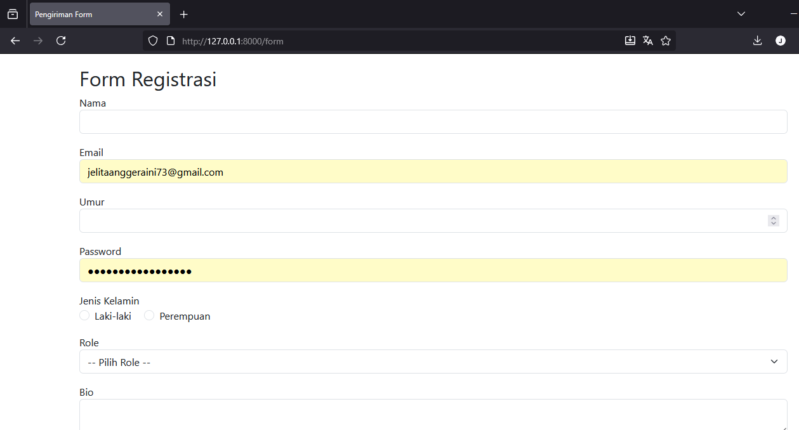
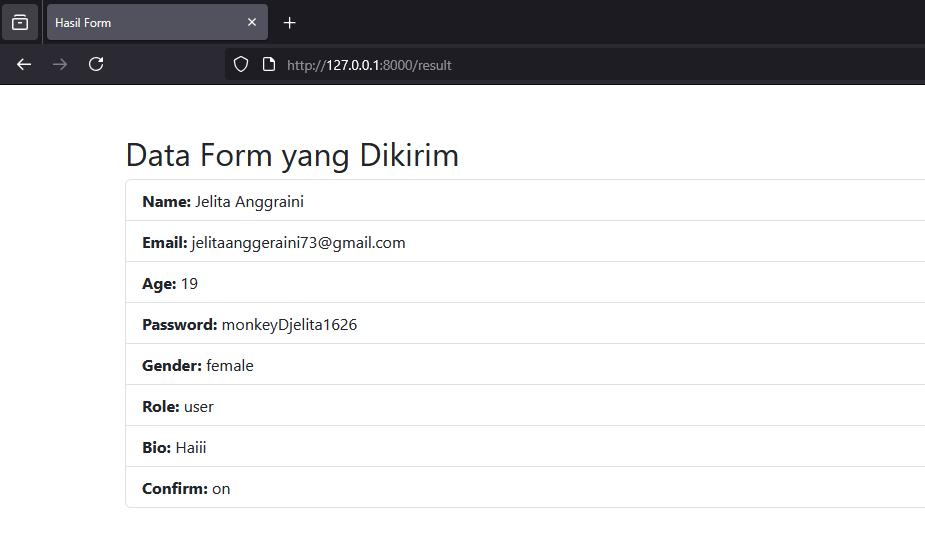
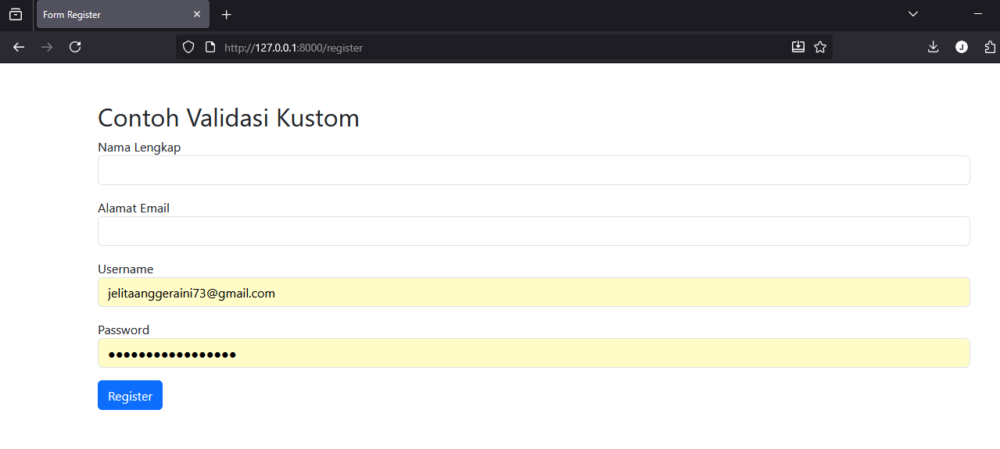
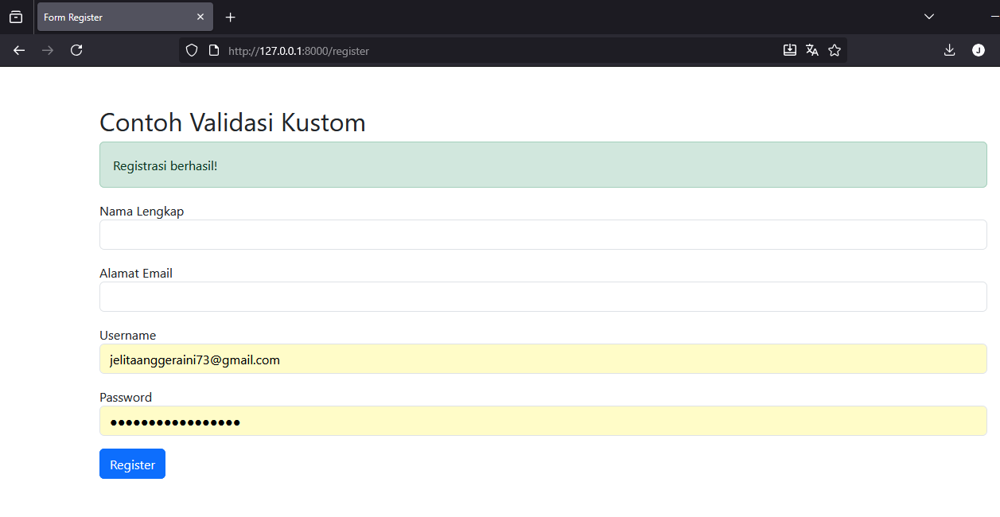
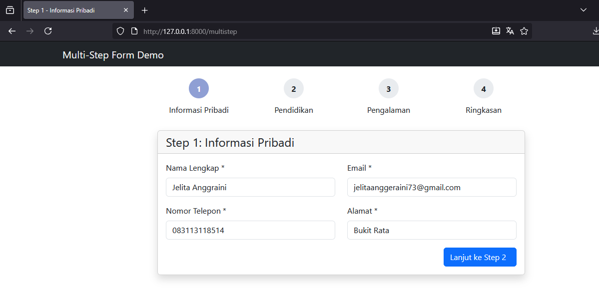
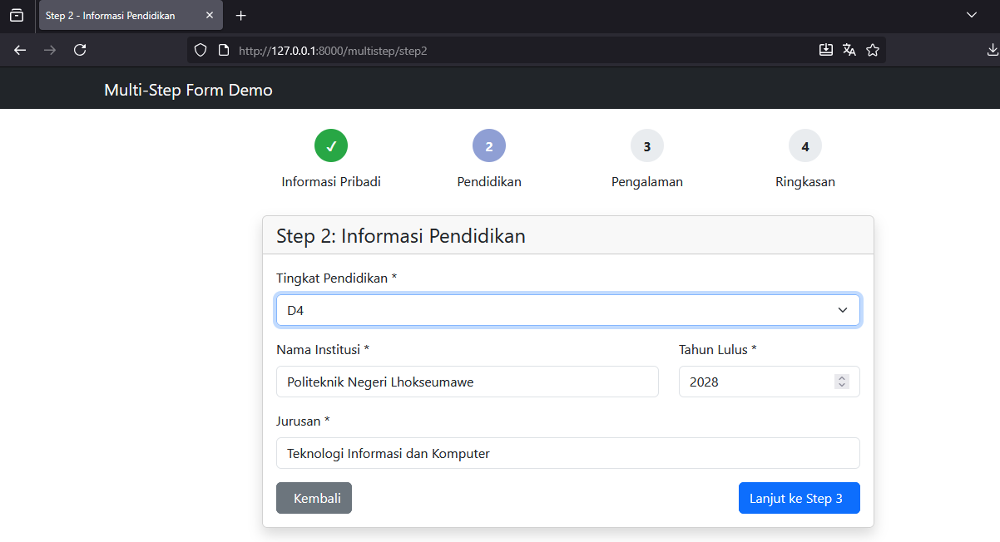
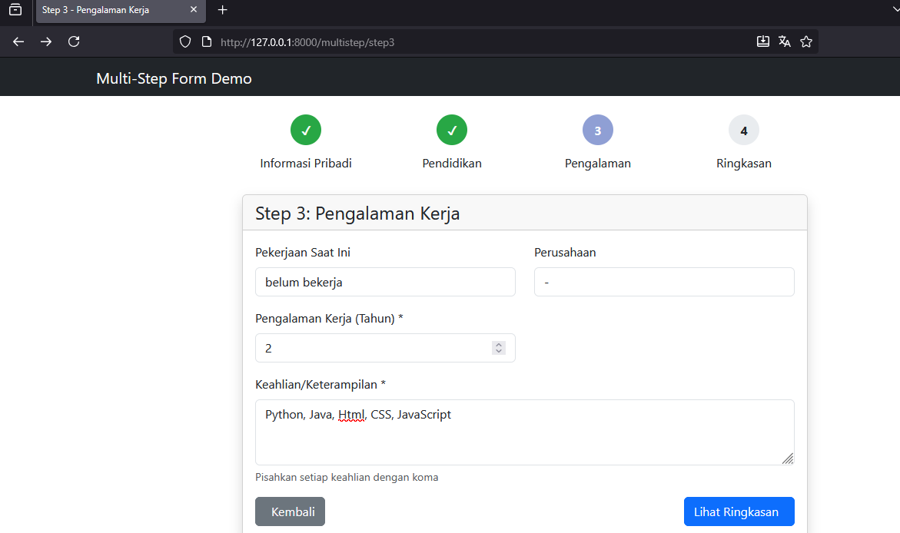
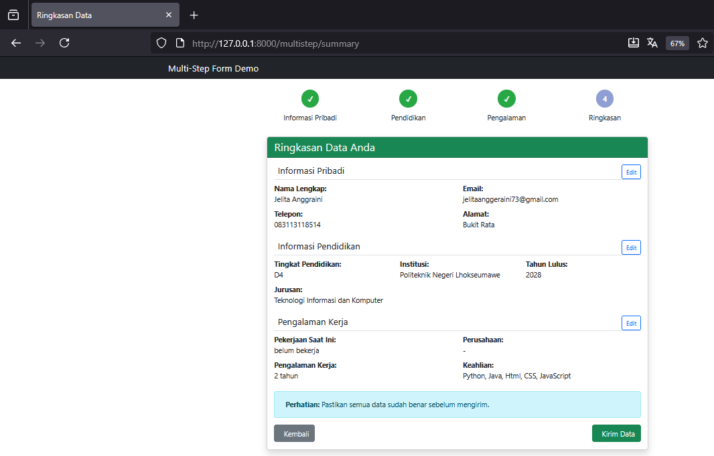

# Laporan Praktikum Modul 5  
## Form Submission & Data Validation  
**Mata Kuliah:** Workshop Web Lanjut  
**Nama:** Jelita Anggraini  
**NIM:** 2024573010015  
**Kelas:** TI-2C 
**Tanggal:** 11 November 2025  

---

## Abstrak
Laporan ini membahas praktikum **Modul 5: Form Submission dan Data Validation pada Laravel**.  
Praktikum ini mempelajari bagaimana Laravel menangani proses form submission, melindungi form dengan token CSRF, serta memvalidasi data input menggunakan berbagai pendekatan: inline validation, Form Request, dan Validator.  
Mahasiswa juga belajar menampilkan pesan error, mempertahankan input lama (`old()`), serta membuat custom messages dan custom validation rule.

---

## Tujuan
1. Memahami mekanisme form submission di Laravel (alur request-response).  
2. Mengimplementasikan validasi data menggunakan berbagai pendekatan (controller, Form Request, Validator).  
3. Menampilkan pesan error dan mempertahankan input lama menggunakan `old()`.  
4. Membuat validasi kustom dan mengatur pesan error kustom.hgf
-

## Dasar Teori

### 1. Arsitektur Request-Response pada Form di Laravel
Proses pengiriman form pada Laravel mengikuti pola MVC (Model - View - Controller), yaitu:
  1. View
    View adalah bagian yang menampilkan tampilan kepada pengguna, termasuk form HTML yang akan diisi oleh user.

  2. Controller
    Controller menerima data yang dikirim dari form. Di sini data akan diperiksa (validasi) dan diproses sesuai kebutuhan.

  3.  Model
    Model berfungsi untuk berinteraksi dengan database, misalnya menyimpan data baru atau mengambil data yang sudah ada.

Dalam proses ini:
- Request adalah data yang dikirim dari browser (client) ke server.
- Response adalah hasil yang dikirim server kembali ke browser setelah data diproses.

---
### 2. Http Method dalam Form Submission
Laravel mendukung beberapa metode HTTP yang digunakan untuk operasi berbeda, antara lain:

| HTTP Method | Fungsi | Contoh Penggunaan |
|------------|--------|------------------|
| GET        | Mengambil atau menampilkan data | Menampilkan form atau daftar data |
| POST       | Mengirim data baru | Menyimpan data dari form input |
| PUT/PATCH  | Mengupdate data yang sudah ada | Mengubah data pada database |
| DELETE     | Menghapus data | Menghapus data dari database |


Namun, HTML form secara default hanya mendukung GET dan POST.

#### Alur Kerja (Lifecycle) Form Submission di Laravel
1.  Pengguna membuka halaman dan mengisi form.
2.  Pengguna menekan tombol Submit.
3.  Browser mengirim HTTP Request ke server sesuai route yang ditentukan.
4.  Middleware memeriksa request, termasuk CSRF Token untuk keamanan.
5.  Route meneruskan request ke method yang sesuai pada Controller.
6.  Controller melakukan validasi data.
7.  Jika valid → Data diteruskan ke Model untuk diproses.
8.  Jika tidak valid → Error dikembalikan ke View.
9.  Setelah proses selesai, server mengirim Response kembali ke browser, misalnya berupa tampilan baru atau pesan berhasil.

### 2. CSRF Protection
Laravel otomatis melindungi form dari serangan CSRF (*Cross-Site Request Forgery*).  
Setiap form wajib menyertakan token `@csrf`:
```blade
<form method="POST" action="/submit">
  @csrf
  ...
</form>
```
Middleware VerifyCsrfToken akan memverifikasi token tersebut sebelum memproses request.

#### Cara Kerja CRSF Token di Laravel
Laravel menggunakan token-based protection:
1.  Setiap session mendapat unique CSRF token
2.  Token disimpan di session user
3.  Direktif @csrf menghasilkan hidden input berisi token
4.  Setiap POST/PUT/PATCH/DELETE request harus menyertakan token
5.  Middleware VerifyCsrfToken membandingkan token dari form dengan token di session
6.  Jika tidak cocok, request ditolak dengan error 419
```
<input type="hidden" name="_token" value="random-string-generated-by-laravel">
```
---
### 3. Data Validation

Validasi digunakan untuk memastikan data yang dikirim user sesuai aturan yang diinginkan.
Validasi data adalah pertahanan pertama aplikasi terhadap:
- Data tidak valid: mencegah data corrupt masuk database
- Security attacks: SQL injection, XSS, dll
- Business logic errors: memastikan data sesuai aturan bisnis
- User experience: memberikan feedback yang jelas

Laravel memiliki beberapa cara untuk melakukan validasi:

- Inline Validation: Validasi langsung di controller menggunakan $request->validate() langsung di controller.
```
$request->validate([
    'email' => 'required|email|unique:users',
    'password' => 'required|min:8'
]);

```
- Form Request Class: membuat validasi terpisah dalam class khusus dengan perintah php artisan make:request.
```
// app/Http/Requests/StoreProductRequest.php
public function rules()
{
    return [
        'name' => 'required|max:255',
        'price' => 'required|numeric'
    ];
}
```
- Manual Validation: menggunakan pendekatan manual dengan Validator::make().
```
$validator = Validator::make($request->all(), [
    'name' => 'required'
]);

if ($validator->fails()) {
    // Custom error handling
}

```


## Langkah-Langkah Praktikum
### Praktikum 1 — Menangani Request dan Response (Laravel 12)
- Langkah 1: Membuat Project dan Routes
```
laravel new form-app
cd form-app
code .
```
Tambahkan routes di routes/web.php:

```
use App\Http\Controllers\FormController;

Route::get('/form', [FormController::class, 'showForm'])->name('form.show');
Route::post('/form', [FormController::class, 'handleForm'])->name('form.handle');
Route::get('/result', [FormController::class, 'showResult'])->name('form.result');
```
- Langkah 2: Membuat Controller
```
php artisan make:controller FormController
```
Isi controller (app/Http/Controllers/FormController.php):
```
namespace App\Http\Controllers;
use Illuminate\Http\Request;
class FormController extends Controller
{
    public function showForm() {
        return view('form');
    }

    public function handleForm(Request $request) {
        $validated = $request->validate([
            'name' => 'required|string|max:255',
            'email' => 'required|email',
            'age' => 'required|integer|min:1',
            'password' => 'required|min:6',
            'gender' => 'required',
            'role' => 'required',
            'bio' => 'required',
            'confirm' => 'accepted',
        ]);

        return redirect()->route('form.result')->with('data', $validated);
    }

    public function showResult() {
        $data = session('data');
        return view('result', compact('data'));
    }
}
```
- Langkah 3: Membuat View Form

File: resources/views/form.blade.php
```
<!DOCTYPE html>
<html>
<head>
  <title>Form Input</title>
</head>
<body>
  <h2>Form Input Data</h2>

  <form method="POST" action="{{ route('form.handle') }}">
    @csrf

    <label>Nama:</label>
    <input type="text" name="name" value="{{ old('name') }}">
    @error('name') <p>{{ $message }}</p> @enderror

    <label>Email:</label>
    <input type="email" name="email" value="{{ old('email') }}">
    @error('email') <p>{{ $message }}</p> @enderror

    <label>Umur:</label>
    <input type="number" name="age" value="{{ old('age') }}">
    @error('age') <p>{{ $message }}</p> @enderror

    <label>Password:</label>
    <input type="password" name="password">
    @error('password') <p>{{ $message }}</p> @enderror

    <label>Gender:</label>
    <select name="gender">
      <option value="">-- Pilih --</option>
      <option value="male" {{ old('gender') == 'male' ? 'selected' : '' }}>Laki-laki</option>
      <option value="female" {{ old('gender') == 'female' ? 'selected' : '' }}>Perempuan</option>
    </select>
    @error('gender') <p>{{ $message }}</p> @enderror

    <label>Peran:</label>
    <input type="radio" name="role" value="admin"> Admin
    <input type="radio" name="role" value="user"> User
    @error('role') <p>{{ $message }}</p> @enderror

    <label>Bio:</label>
    <textarea name="bio">{{ old('bio') }}</textarea>
    @error('bio') <p>{{ $message }}</p> @enderror

    <label>
      <input type="checkbox" name="confirm" {{ old('confirm') ? 'checked' : '' }}> Saya setuju
    </label>
    @error('confirm') <p>{{ $message }}</p> @enderror

    <button type="submit">Kirim</button>
  </form>
</body>
</html>
```
- Langkah 4: Membuat View Hasil

File: resources/views/result.blade.php
```
<!DOCTYPE html>
<html>
<head>
  <title>Hasil Input</title>
</head>
<body>
  <h2>Data Hasil Input</h2>

  @if ($data)
    <ul>
      @foreach ($data as $key => $value)
        <li><strong>{{ ucfirst($key) }}:</strong> {{ $value }}</li>
      @endforeach
    </ul>
  @else
    <p>Tidak ada data tersedia.</p>
  @endif

  <a href="{{ route('form.show') }}">Kembali ke Form</a>
</body>
</html>
```
- Langkah 5: Menjalankan Aplikasi
```
php artisan serve
```

Akses di browser: http://localhost:8000/form

**Berikut adalah tampilan hasil dari praktikum 1 :**
http://127.0.0.1:8000/form

Hasil sesudah isi Form


Output dari percobaan praktikum 1 menampilkan halaman Form Registrasi yang berisi berbagai input seperti nama, email, umur, password, jenis kelamin, role, dan bio. Form ini sudah menggunakan proteksi CSRF token serta fitur old() untuk mempertahankan data yang telah diisi. Pada gambar terlihat field email dan password sudah diisi, sedangkan field lain masih kosong. Saat tombol “Kirim” ditekan dengan data belum lengkap, Laravel akan menolak pengiriman dan menampilkan pesan error di bawah setiap input yang belum valid.
Hasil ini menunjukkan bahwa proses form submission dan validasi di Laravel berjalan dengan baik. Laravel mampu memverifikasi data input sesuai aturan yang telah ditentukan di controller, menjaga keamanan form, serta memberikan pengalaman pengguna yang lebih baik dengan mempertahankan nilai input sebelumnya.

### Praktikum 2 — Validasi Kustom dan Pesan Error
- Langkah 1: Menambahkan Route
Buka project praktikum 1 sebelumnya, kemudian tambahkan route baru berikut:
```
use App\Http\Controllers\RegisterController;

Route::get('/register', [RegisterController::class, 'showForm'])->name('register.show');
Route::post('/register', [RegisterController::class, 'handleForm'])->name('register.handle');
```
- Langkah 2: Membuat Controller
```
php artisan make:controller RegisterController
```
Isi file app/Http/Controllers/RegisterController.php:
```
namespace App\Http\Controllers;
use Illuminate\Http\Request;
class RegisterController extends Controller
{
    public function showForm() {
        return view('register');
    }

    public function handleForm(Request $request) {
        $customMessages = [
            'name.required' => 'Kami perlu tahu nama Anda!',
            'email.required' => 'Email Anda penting bagi kami.',
            'email.email' => 'Hmm... itu tidak terlihat seperti email yang valid.',
            'password.required' => 'Jangan lupa untuk set password.',
            'password.min' => 'Password harus minimal :min karakter.',
            'username.regex' => 'Username hanya boleh berisi huruf dan angka.',
        ];

        $request->validate([
            'name' => 'required|string|max:100',
            'email' => 'required|email',
            'username' => ['required', 'regex:/^[a-zA-Z0-9]+$/'],
            'password' => 'required|min:6',
        ], $customMessages);

        return redirect()->route('register.show')->with('success', 'Registrasi berhasil!');
    }
}
```
- Langkah 3: Membuat View

File: resources/views/register.blade.php
```
<!DOCTYPE html>
<html>
<head>
  <title>Form Registrasi</title>
</head>
<body>
  <h2>Form Registrasi</h2>

  @if (session('success'))
    <p style="color:green">{{ session('success') }}</p>
  @endif

  <form method="POST" action="{{ route('register.handle') }}">
    @csrf

    <label>Nama:</label>
    <input type="text" name="name" value="{{ old('name') }}">
    @error('name') <p>{{ $message }}</p> @enderror

    <label>Email:</label>
    <input type="email" name="email" value="{{ old('email') }}">
    @error('email') <p>{{ $message }}</p> @enderror

    <label>Username:</label>
    <input type="text" name="username" value="{{ old('username') }}">
    @error('username') <p>{{ $message }}</p> @enderror

    <label>Password:</label>
    <input type="password" name="password">
    @error('password') <p>{{ $message }}</p> @enderror

    <button type="submit">Daftar</button>
  </form>
</body>
</html>
```

- Langkah 4: Menjalankan Aplikasi
```
php artisan serve
```

Akses di browser: http://localhost:8000/register

**Berikut adalah tampilan hasil dari praktikum 1 :**
http://127.0.0.1:8000/register

Hasil sesudah isi Form


### Praktikum 3 — Multi-Step Form Submission dengan Session Data

- Langkah 1: Membuat Project Laravel Baru
Buat project baru dengan Laravel installer:

```bash
laravel new multistep-form-app
cd multistep-form-app
code .
```
- Langkah 2: Membuat Layout Dasar

Buat file layout utama di:
resources/views/layouts/app.blade.php
```
<!DOCTYPE html>
<html lang="id">
<head>
    <meta charset="UTF-8">
    <meta name="viewport" content="width=device-width, initial-scale=1.0">
    <title>@yield('title', 'Multi-Step Form')</title>
    <link href="https://cdn.jsdelivr.net/npm/bootstrap@5.3.3/dist/css/bootstrap.min.css" rel="stylesheet">
    <style>
        .step-progress { margin-bottom: 30px; }
        .step-item { text-align: center; position: relative; }
        .step-item .step-number {
            width: 40px; height: 40px; border-radius: 50%;
            background: #e9ecef; display: flex;
            align-items: center; justify-content: center;
            margin: 0 auto 10px; font-weight: bold;
        }
        .step-item.active .step-number { background: #007bff; color: white; }
        .step-item.completed .step-number { background: #28a745; color: white; }
        .card { box-shadow: 0 0.5rem 1rem rgba(0, 0, 0, 0.15); }
    </style>
</head>
<body>
    <nav class="navbar navbar-dark bg-dark">
        <div class="container">
            <span class="navbar-brand mb-0 h1">Multi-Step Form Demo</span>
        </div>
    </nav>

    <div class="container mt-4">
        @yield('content')
    </div>

    <script src="https://cdn.jsdelivr.net/npm/bootstrap@5.3.3/dist/js/bootstrap.bundle.min.js"></script>
</body>
</html>
```
- Langkah 3: Menambahkan Routes

Buka file routes/web.php dan tambahkan semua route berikut:
```
use App\Http\Controllers\MultiStepFormController;
use Illuminate\Support\Facades\Route;

Route::get('/multistep', [MultiStepFormController::class, 'showStep1'])->name('multistep.step1');
Route::post('/multistep/step1', [MultiStepFormController::class, 'storeStep1'])->name('multistep.storeStep1');
Route::get('/multistep/step2', [MultiStepFormController::class, 'showStep2'])->name('multistep.step2');
Route::post('/multistep/step2', [MultiStepFormController::class, 'storeStep2'])->name('multistep.storeStep2');
Route::get('/multistep/step3', [MultiStepFormController::class, 'showStep3'])->name('multistep.step3');
Route::post('/multistep/step3', [MultiStepFormController::class, 'storeStep3'])->name('multistep.storeStep3');
Route::get('/multistep/summary', [MultiStepFormController::class, 'showSummary'])->name('multistep.summary');
Route::post('/multistep/complete', [MultiStepFormController::class, 'complete'])->name('multistep.complete');
```
- Langkah 4: Membuat Controller

Buat controller baru dengan perintah:
```
php artisan make:controller MultiStepFormController
```
Kemudian isi file app/Http/Controllers/MultiStepFormController.php dengan kode berikut:
```
<?php

namespace App\Http\Controllers;

use Illuminate\Http\Request;

class MultiStepFormController extends Controller
{
    // Step 1 - Informasi Pribadi
    public function showStep1()
    {
        return view('multistep.step1', ['step' => 1, 'progress' => 0]);
    }

    public function storeStep1(Request $request)
    {
        $validated = $request->validate([
            'full_name' => 'required|string|max:100',
            'email' => 'required|email',
            'phone' => 'required|string|max:15',
            'address' => 'required|string|max:200',
        ]);
        session(['step1_data' => $validated]);
        return redirect()->route('multistep.step2');
    }

    // Step 2 - Informasi Pendidikan
    public function showStep2()
    {
        if (!session('step1_data')) return redirect()->route('multistep.step1');
        return view('multistep.step2', ['step' => 2, 'progress' => 33]);
    }

    public function storeStep2(Request $request)
    {
        $validated = $request->validate([
            'education' => 'required|string|max:50',
            'institution' => 'required|string|max:100',
            'graduation_year' => 'required|integer|min:1900|max:' . date('Y'),
            'major' => 'required|string|max:100',
        ]);
        session(['step2_data' => $validated]);
        return redirect()->route('multistep.step3');
    }

    // Step 3 - Pengalaman Kerja
    public function showStep3()
    {
        if (!session('step1_data') || !session('step2_data')) return redirect()->route('multistep.step1');
        return view('multistep.step3', ['step' => 3, 'progress' => 66]);
    }

    public function storeStep3(Request $request)
    {
        $validated = $request->validate([
            'current_job' => 'nullable|string|max:100',
            'company' => 'nullable|string|max:100',
            'experience_years' => 'required|integer|min:0|max:50',
            'skills' => 'required|string|max:200',
        ]);
        session(['step3_data' => $validated]);
        return redirect()->route('multistep.summary');
    }

    // Summary - Ringkasan
    public function showSummary()
    {
        $step1 = session('step1_data');
        $step2 = session('step2_data');
        $step3 = session('step3_data');
        if (!$step1 || !$step2 || !$step3) return redirect()->route('multistep.step1');

        return view('multistep.summary', [
            'step' => 4,
            'progress' => 100,
            'step1Data' => $step1,
            'step2Data' => $step2,
            'step3Data' => $step3
        ]);
    }

    // Complete - Selesai
    public function complete(Request $request)
    {
        $allData = [
            'personal' => session('step1_data'),
            'education' => session('step2_data'),
            'experience' => session('step3_data')
        ];

        $request->session()->forget(['step1_data', 'step2_data', 'step3_data']);

        return view('multistep.complete', ['data' => $allData]);
    }
}
```
- Langkah 5: Membuat Views untuk Setiap Step

📄 Step 1 — Informasi Pribadi

File: resources/views/multistep/step1.blade.php
Berisi form untuk mengisi nama lengkap, email, nomor telepon, dan alamat.

📄 Step 2 — Informasi Pendidikan

File: resources/views/multistep/step2.blade.php
Berisi form untuk memilih tingkat pendidikan, institusi, tahun lulus, dan jurusan.

📄 Step 3 — Pengalaman Kerja

File: resources/views/multistep/step3.blade.php
Berisi form untuk mengisi pekerjaan saat ini, perusahaan, lama pengalaman, dan keahlian.

📄 Summary — Ringkasan Data

File: resources/views/multistep/summary.blade.php
Menampilkan ringkasan seluruh data dari ketiga step sebelumnya dengan tombol untuk mengedit atau menyelesaikan form.

📄 Complete — Halaman Selesai

File: resources/views/multistep/complete.blade.php
Menampilkan pesan “Pendaftaran Berhasil” dan data hasil pengisian yang telah dikumpulkan.

- Langkah 6: Menjalankan Aplikasi

Jalankan server Laravel:
```
php artisan serve
```

Kemudian buka di browser:
http://localhost:8000/multistep

Ikuti langkah-langkah berikut:

Step 1: Isi informasi pribadi (nama, email, telepon, alamat).

Step 2: Isi informasi pendidikan (tingkat, institusi, tahun lulus, jurusan).

Step 3: Isi pengalaman kerja (pekerjaan saat ini, perusahaan, pengalaman, keahlian).

Summary: Periksa dan konfirmasi data.

Complete: Tampilkan pesan sukses bahwa pendaftaran telah selesai.

**Berikut adalah tampilan hasil dari praktikum 3 :**
http://127.0.0.1:8000/multistep

http://127.0.0.1:8000/multistep/step2

http://127.0.0.1:8000/multistep/step3

http://127.0.0.1:8000/multistep/summary


## Hasil dan Pembahasan

Dari hasil ketiga praktikum yang telah dilakukan, dapat disimpulkan bahwa proses form submission di Laravel berjalan melalui serangkaian tahapan yang terstruktur, mulai dari penerimaan data melalui view, pemrosesan di controller, hingga validasi dan pengiriman hasil kembali ke pengguna. Pada Praktikum 1, sistem berhasil menampilkan form dengan berbagai jenis input dan memvalidasi data menggunakan metode validate() di controller. Ketika ada input yang tidak sesuai, Laravel secara otomatis menampilkan pesan error di bawah field yang bersangkutan dan mempertahankan nilai lama dengan fungsi old().

Selanjutnya, Praktikum 2 memperluas konsep validasi dengan menerapkan pesan error kustom (custom messages) serta aturan validasi regex. Penggunaan custom validation ini membuat form menjadi lebih interaktif dan ramah pengguna karena pesan error dapat disesuaikan dengan konteks. Terakhir, pada Praktikum 3, sistem berhasil mengimplementasikan multi-step form submission menggunakan session untuk menyimpan data sementara di setiap langkah. Pendekatan ini membuktikan bahwa Laravel mampu mengelola proses input data kompleks dengan efisien dan aman, sekaligus memberikan pengalaman pengguna yang lebih baik dengan membagi form panjang menjadi beberapa tahap yang lebih sederhana.

## Kesimpulan

Dari praktikum ini diperoleh pemahaman tentang bagaimana Laravel memproses form submission dan melakukan validasi data dengan berbagai pendekatan.
Mahasiswa mampu membuat form yang aman, memvalidasi input dengan tepat, serta menampilkan pesan error yang jelas dan informatif.

## Referensi

Modul Praktikum 5 — Form Submission & Data Validation, HackMD: https://hackmd.io/@mohdrzu/HJWzYp7Reg

Laravel Documentation — Requests & Validation: https://laravel.com/docs