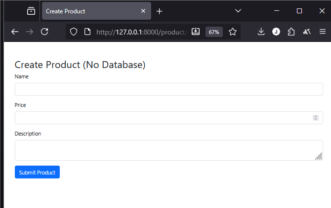
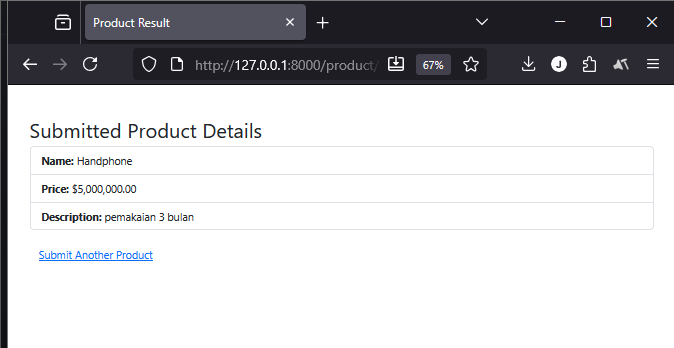

# Laporan Modul 6 
## Model dan Laravel Eloquent  
**Mata Kuliah:** Workshop Web Lanjut  
**Nama:** Jelita Anggraini  
**NIM:** 2024573010015  
**Kelas:** TI-2C  

---

## Abstrak
Laporan ini membahas hasil praktikum Modul 6 yang berfokus pada penerapan Model dan Eloquent ORM dalam framework Laravel. Praktikum ini bertujuan untuk memahami bagaimana model berperan sebagai penghubung antara logika aplikasi dan database, serta bagaimana konsep POCO (Plain Old CLR Object), DTO (Data Transfer Object), dan Service Layer diterapkan dalam arsitektur MVC. Selain itu, laporan ini juga menjelaskan proses pembuatan model Eloquent, migrasi database, dan implementasi operasi CRUD (Create, Read, Update, Delete) secara menyeluruh. Dengan praktikum ini, mahasiswa diharapkan mampu membangun struktur aplikasi yang terorganisir, efisien, dan mudah dikembangkan menggunakan Laravel Eloquent ORM.

---

## Tujuan
1. Memahami konsep Model dalam arsitektur MVC pada Laravel.  
2. Mengimplementasikan model sederhana (POCO) untuk binding form tanpa database.  
3. Menggunakan DTO dan service layer untuk memisahkan concern.  
4. Memperkenalkan Eloquent: migrasi, model Eloquent, dan operasi CRUD dasar.  
5. Mendokumentasikan langkah-langkah praktikum secara lengkap dan reproducible.

---

## Dasar Teori
- **Model (Laravel):** Representasi struktur data aplikasi; biasanya berhubungan dengan tabel DB dan dikelola oleh Eloquent ORM.  
- **POCO / ViewModel:** Kelas PHP sederhana untuk menampung data tanpa ketergantungan pada DB (berguna saat latihan tanpa DB).  
- **DTO (Data Transfer Object):** Objek ringan untuk membawa data antar lapisan (request → controller → service).  
- **Repository / Service Pattern:** Abstraksi akses data dan logika bisnis agar controller tetap tipis dan mudah diuji.  
- **Eloquent:** ORM Laravel untuk operasi database (migrations, models, seeder, query builder).

---

## Lingkungan & Persiapan
1. Pastikan PHP (≥8.1), Composer, dan Laravel installer/laravel new tersedia.  
2. Direkomendasikan memakai VS Code, dan menjalankan `php artisan serve` untuk akses lokal.  
3. (Opsional) Jika ingin memakai DB: MySQL/MariaDB atau SQLite, atur file `.env`.

---

## Praktikum 1 — Model POCO: Binding Form & Tampilkan Data (Tanpa Database)

### Tujuan
Membuat kelas model sederhana (POCO/ViewModel) untuk menerima data dari form dan menampilkan hasilnya pada halaman baru.

### Langkah-langkah

#### Langkah 1 — Buat proyek (jika baru)
```bash
laravel new model-app
cd model-app
code .
```
#### Langkah 2 — Buat folder ViewModels & kelas ProductViewModel
```
mkdir -p app/ViewModels
```
Buat file app/ViewModels/ProductViewModel.php:
```
<?php
namespace App\ViewModels;

class ProductViewModel {
    public string $name;
    public float $price;
    public string $description;

    public function __construct(string $name = '', float $price = 0.0, string $description = '') {
        $this->name = $name;
        $this->price = $price;
        $this->description = $description;
    }

    public static function fromRequest(array $data): self {
        return new self(
            $data['name'] ?? '',
            (float) ($data['price'] ?? 0),
            $data['description'] ?? ''
        );
    }
}
```
Langkah 3 — Buat Controller
```
php artisan make:controller ProductController
```
Edit app/Http/Controllers/ProductController.php:
```
<?php
namespace App\Http\Controllers;

use Illuminate\Http\Request;
use App\ViewModels\ProductViewModel;

class ProductController extends Controller {
    public function create() {
        return view('product.create');
    }

    public function result(Request $request) {
        $product = ProductViewModel::fromRequest($request->all());
        return view('product.result', compact('product'));
    }
}
```
#### Langkah 4 — Tambahkan route

File routes/web.php:
```
use App\Http\Controllers\ProductController;
use Illuminate\Support\Facades\Route;

Route::get('/product/create', [ProductController::class, 'create'])->name('product.create');
Route::post('/product/result', [ProductController::class, 'result'])->name('product.result');
```
#### Langkah 5 — Buat view

Folder: resources/views/product

**create.blade.php**
```
<!doctype html>
<html>
<head>
  <meta charset="utf-8">
  <title>Create Product</title>
  <link href="https://cdn.jsdelivr.net/npm/bootstrap@5.3.3/dist/css/bootstrap.min.css" rel="stylesheet">
</head>
<body class="container py-5">
  <h2>Create Product (No Database)</h2>
  <form method="POST" action="{{ route('product.result') }}">
    @csrf
    <div class="mb-3"><label class="form-label">Name</label><input name="name" class="form-control" required></div>
    <div class="mb-3"><label class="form-label">Price</label><input name="price" type="number" step="0.01" class="form-control" required></div>
    <div class="mb-3"><label class="form-label">Description</label><textarea name="description" class="form-control"></textarea></div>
    <button class="btn btn-primary" type="submit">Submit</button>
  </form>
</body>
</html>
```

**result.blade.php**

```
<!doctype html>
<html>
<head>
  <meta charset="utf-8">
  <title>Product Result</title>
  <link href="https://cdn.jsdelivr.net/npm/bootstrap@5.3.3/dist/css/bootstrap.min.css" rel="stylesheet">
</head>
<body class="container py-5">
  <h2>Submitted Product Details</h2>
  <ul class="list-group">
    <li class="list-group-item"><strong>Name:</strong> {{ $product->name }}</li>
    <li class="list-group-item"><strong>Price:</strong> ${{ number_format($product->price, 2) }}</li>
    <li class="list-group-item"><strong>Description:</strong> {{ $product->description }}</li>
  </ul>
  <a href="{{ route('product.create') }}" class="btn btn-link mt-3">Submit Another</a>
</body>
</html>
```
#### Langkah 6 — Jalankan & Uji
```
php artisan serve
```
buka http://localhost:8000/product/create

Isi form → submit → halaman hasil menampilkan data yang dikirim.



# Praktikum 2 — Menggunakan DTO (Data Transfer Object)

## Tujuan
Menambahkan DTO dan service layer untuk memproses data sebelum ditampilkan; memperlihatkan pola pemisahan tanggung jawab.

##Langkah-langkah
#### Langkah 1 — Buat folder DTO dan Service
```
laravel new dto-app
cd dto-app
code .

```
#### Langkah 2 — Buat kelas DTO app/DTO/ProductDTO.php
BuatBuka project praktikum 1 sebelumnya, kemudian buat kelas DTO untuk menyimpan data produk. Kelas ini akan memiliki properti untuk nama produk, harga, dan deskripsi. Kelas juga akan memiliki metode statis fromRequest() untuk memetakan data dari request ke DTO.
Buat folder DTO didalam app :

```mkdir app/DTO
```

```
<?php
namespace App\DTO;

class ProductDTO {
    public string $name;
    public float $price;
    public string $description;

    public function __construct(string $name, float $price, string $description) {
        $this->name = $name;
        $this->price = $price;
        $this->description = $description;
    }

    public static function fromRequest(array $data): self {
        return new self(
            $data['name'] ?? '',
            (float) ($data['price'] ?? 0),
            $data['description'] ?? ''
        );
    }
}
```
#### Langkah 3 — Buat Service app/Services/ProductService.php
```
<?php
namespace App\Services;

use App\DTO\ProductDTO;

class ProductService {
    public function display(ProductDTO $product): array {
        // proses sederhana (mis. format, validasi tambahan)
        return [
            'name' => strtoupper($product->name),
            'price' => $product->price,
            'description' => $product->description
        ];
    }
}
```
#### Langkah 4 — Buat Controller
```
php artisan make:controller ProductController
```

Edit file app/Http/Controllers/ProductController.php:
```
use App\DTO\ProductDTO;
use App\Services\ProductService;

public function result(Request $request) {
    $dto = ProductDTO::fromRequest($request->all());
    $service = new ProductService();
    $product = $service->display($dto);
    return view('product.result', compact('product'));
}
```
#### Langkah 5 — Uji Buat Tampilan (Views) dengan Bootstrap

Jalankan php artisan serve → isi form di /product/create → submit → verifikasi transformasi (mis. nama huruf besar).

# Praktikum 3 — Eloquent Dasar: Migrasi, Model, dan CRUD Singkat

## Tujuan

Menyiapkan tabel products, model Eloquent, migrasi, dan endpoint CRUD sederhana.

## Langkah-langkah
#### Langkah 1 — Siapkan database

File .env:
```
DB_CONNECTION=mysql
DB_HOST=127.0.0.1
DB_PORT=3306
DB_DATABASE=model_app
DB_USERNAME=root
DB_PASSWORD=secret
```

Atau gunakan SQLite: buat file database/database.sqlite dan set DB_CONNECTION=sqlite di .env.

#### Langkah 2 — Buat migrasi & model
```
php artisan make:model Product -m
```

Isi database/migrations/xxxx_create_products_table.php:
```
public function up() {
    Schema::create('products', function (Blueprint $table) {
        $table->id();
        $table->string('name');
        $table->decimal('price', 10, 2);
        $table->text('description')->nullable();
        $table->timestamps();
    });
}
```
Jalankan:
```
php artisan migrate
```
#### Langkah 3 — Definisikan model app/Models/Product.php
```
<?php
namespace App\Models;

use Illuminate\Database\Eloquent\Model;

class Product extends Model {
    protected $fillable = ['name','price','description'];
}
```
#### Langkah 4 — Buat controller resource
```
php artisan make:controller ProductEloquentController --resource
```

Contoh method store:
```
public function store(Request $request) {
    $validated = $request->validate([
        'name' => 'required|string|max:255',
        'price' => 'required|numeric',
        'description' => 'nullable|string'
    ]);
    $product = \App\Models\Product::create($validated);
    return redirect()->route('products.show', $product);
}
```
#### Langkah 5 — Tambahkan route resource

File routes/web.php:
```
use App\Http\Controllers\ProductEloquentController;
Route::resource('products', ProductEloquentController::class);
```
#### Langkah 6 — Views & Uji CRUD

Buat view index/create/show/edit sesuai kebutuhan.
Lalu akses:
```
GET /products → lihat daftar
GET /products/create → form buat
POST /products → simpan
GET /products/{id} → lihat detail
GET /products/{id}/edit → edit
PUT/PATCH /products/{id} → update
DELETE /products/{id} → hapus
```
## Hasil dan Pembahasan

1. Praktikum 1 (POCO): Form berhasil mengikat data ke objek ProductViewModel dan menampilkan tanpa DB.

2. Praktikum 2 (DTO + Service): DTO memudahkan pemisahan tanggung jawab; service melakukan transformasi data.

3. Praktikum 3 (Eloquent): Migrasi dan model Eloquent memudahkan CRUD. Pastikan konfigurasi .env benar sebelum migrate.

4. Validasi & Error Handling: Gunakan $request->validate() untuk mencegah data tidak valid dan tangani error dengan baik.

5. Kesimpulan

- Model di Laravel bisa dipakai sebagai POCO (tanpa DB) atau Eloquent Model (terhubung ke DB).

- DTO dan service layer meningkatkan keterbacaan dan maintainability kode.

- Migrasi + Eloquent memudahkan manajemen skema dan operasi data pada aplikasi nyata.

- Format laporan mengikuti contoh PDF referensi sebelumnya.

## Lampiran — Potongan Perintah & Catatan

- Buat controller: php artisan make:controller ProductController
- Buat model + migrasi: php artisan make:model Product -m
- Jalankan server: php artisan serve
- Jalankan migrasi: php artisan migrate
- Periksa .env jika migrasi gagal
- Jangan lupa @csrf pada form POST

## Referensi

Modul 6 — Model dan Laravel Eloquent (HackMD)

Laporan referensi sebelumnya — Laporan Laravel Fundamental Jelita_Anggraini.TI-2C.pdf

Laravel Documentation