# Laporan Modul 9: RESTful API Menggunakan Laravel 12

**Mata Kuliah:** Workshop Web Lanjut  
**Nama:** Jelita Anggraini 
**NIM:** 2024573010015  
**Kelas:** TI-2C

---

## Abstrak

Praktikum Modul 9 membahas proses pembuatan RESTful API menggunakan framework Laravel 12 dengan pendekatan yang sistematis dan mudah dipahami. Pada modul ini, API dikembangkan untuk mengelola data produk dengan menerapkan operasi CRUD (Create, Read, Update, Delete). Tahapan yang dilakukan meliputi instalasi Laravel, pembuatan model dan migration database, penerapan validasi request, penggunaan API Resource dan Collection untuk membentuk respons JSON, serta pembuatan controller sebagai pusat logika aplikasi. Dengan alur tersebut, API yang dihasilkan memiliki struktur respons yang konsisten, mudah digunakan oleh aplikasi frontend, serta mengikuti prinsip standar REST. Praktikum ini memberikan gambaran nyata tentang pengembangan backend modern berbasis Laravel.

---

## 1. Dasar Teori

Landasan teori berikut digunakan sebagai acuan dalam pelaksanaan praktikum.

### RESTful API

RESTful API merupakan arsitektur layanan web yang memanfaatkan protokol HTTP sebagai media komunikasi antara client dan server. Setiap proses pengolahan data dilakukan menggunakan metode HTTP seperti GET untuk menampilkan data, POST untuk menambahkan data, PUT atau PATCH untuk memperbarui data, dan DELETE untuk menghapus data. Pendekatan ini banyak digunakan karena sederhana, fleksibel, dan dapat diintegrasikan dengan berbagai platform.

### Model dan Migration

Laravel menggunakan Eloquent ORM untuk mempermudah interaksi dengan database. Model berfungsi sebagai representasi tabel dalam database, sedangkan migration digunakan untuk mendefinisikan struktur tabel secara terprogram. Dengan migration, perubahan skema database dapat dikelola dengan rapi dan terkontrol.

### Validasi Request

Validasi data dilakukan sebelum data diproses oleh controller. Laravel menyediakan Form Request yang berfungsi untuk memeriksa kesesuaian data input dengan aturan yang telah ditentukan, sehingga data yang tidak valid dapat langsung ditolak.

### API Resource dan Collection

API Resource digunakan untuk mengatur format data yang dikirimkan ke client agar lebih konsisten dan mudah dibaca. Sementara itu, Resource Collection digunakan untuk menampilkan kumpulan data sekaligus, termasuk informasi tambahan seperti pagination. Penggunaan resource membantu menjaga kerapian struktur respons API.

### Controller dan Routing

Controller berperan sebagai pengelola logika aplikasi, sedangkan routing API digunakan untuk menentukan endpoint dan mengarahkan request ke controller yang sesuai. Laravel menyediakan fitur `Route::apiResource` yang mempermudah pembuatan route CRUD sesuai dengan standar REST.

---

## 2. Langkah-Langkah Praktikum

### Praktikum – Pembuatan RESTful API Menggunakan Laravel 12

1. Membuat proyek Laravel baru dengan konfigurasi API.
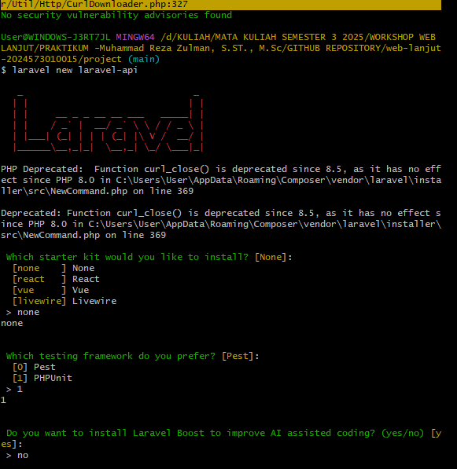
2. Menginstal komponen pendukung API pada Laravel versi terbaru.
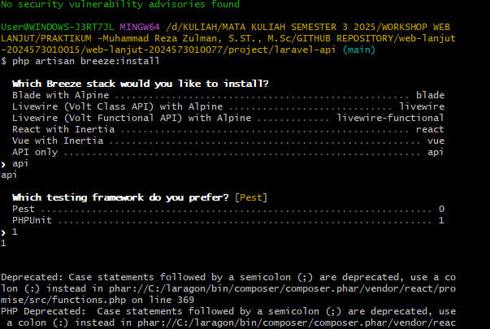
3. Membuat model dan migration untuk entitas Product.
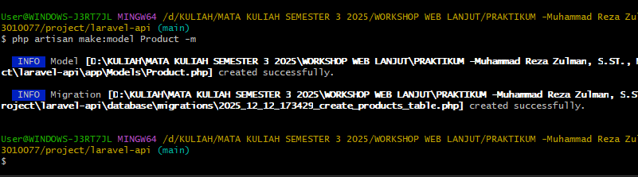
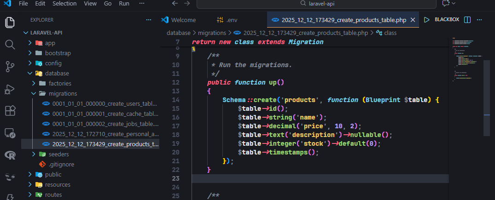
4. Menyesuaikan struktur tabel products sesuai kebutuhan data.
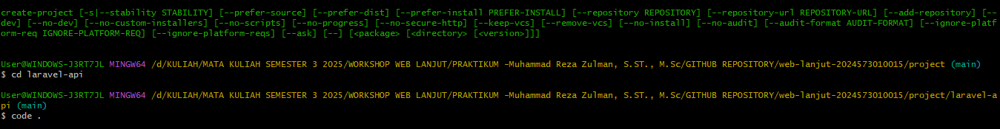
5. Mengatur properti `$fillable` pada model agar mendukung mass assignment.
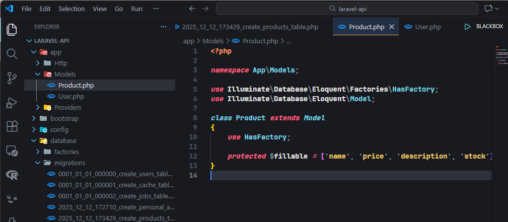
6. Membuat Form Request untuk validasi input data produk.
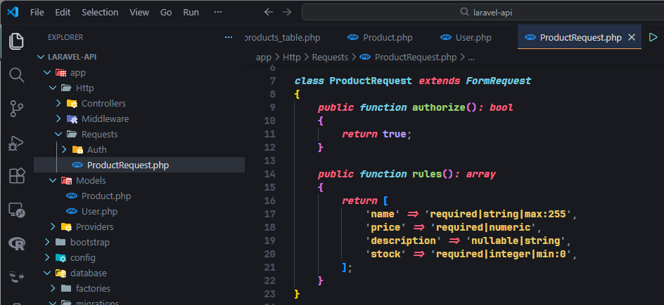
7. Membuat API Resource dan Collection untuk mengatur format respons JSON.

8. Membuat ProductController untuk menangani proses CRUD.
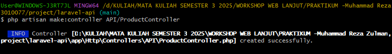
9. Mendefinisikan route API menggunakan `Route::apiResource`.
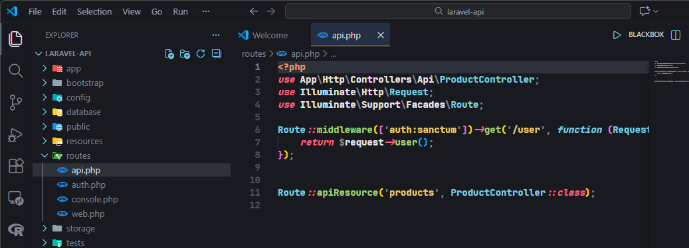
10. Menjalankan server Laravel dan menguji endpoint API menggunakan Postman.
`1. Menjalankan Server`
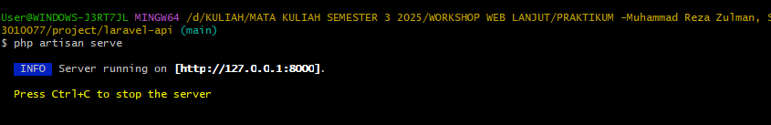
`2. Pengujian Index Data menggunakan postman`
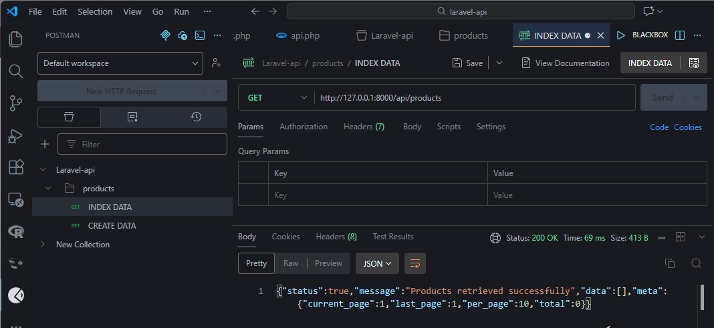
`3. Pegujian Create Data menggunakan postman`
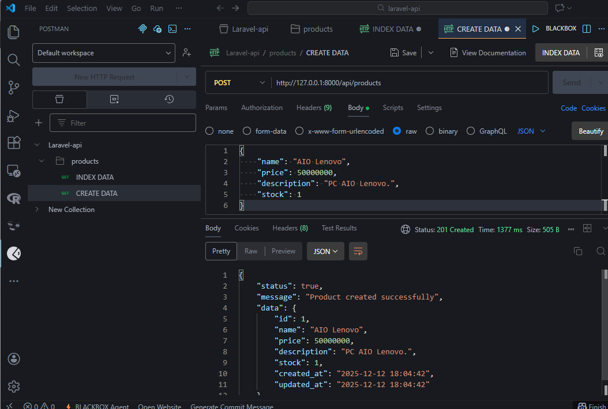
`3. Pegujian Update Data menggunakan postman`
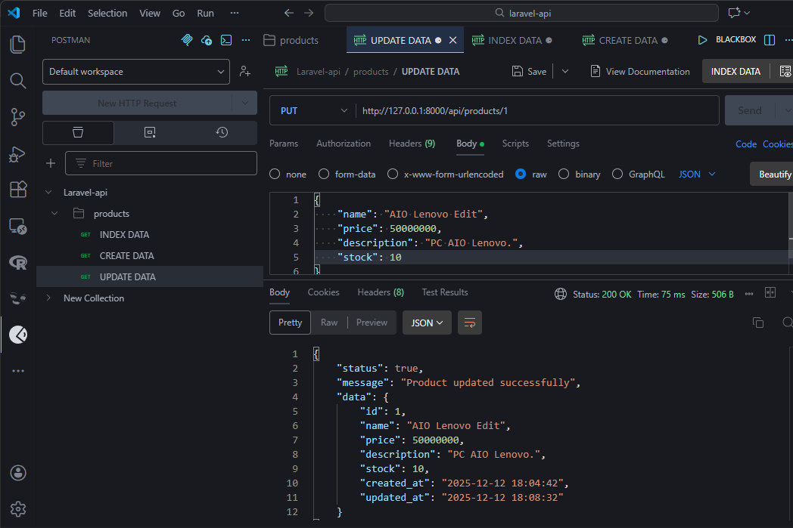
`4. Pegujian Update Data menggunakan postman`
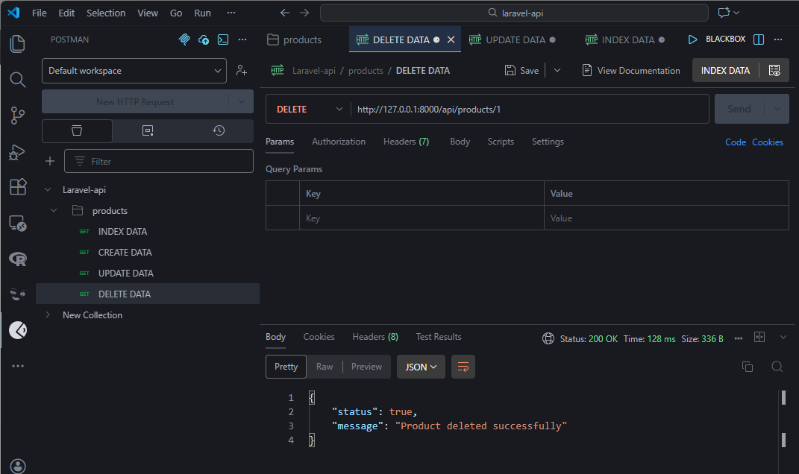

---

## 3. Hasil dan Pembahasan

### Hasil Praktikum

Hasil dari praktikum ini adalah sebuah RESTful API produk yang dapat berjalan dengan baik di Laravel 12. API mampu melakukan operasi CRUD secara lengkap dan memberikan respons dalam format JSON yang rapi serta konsisten. Selain itu, validasi input berjalan dengan baik sehingga data yang masuk ke database tetap terjaga kualitas dan keamanannya.

### Mekanisme Validasi Input di Laravel

Laravel melakukan validasi melalui Form Request sebelum data diproses lebih lanjut oleh controller. Apabila data yang dikirimkan tidak sesuai dengan aturan, sistem akan langsung mengembalikan pesan kesalahan dalam format JSON tanpa menyimpan data ke database.

### Peran Masing-Masing Komponen

* **Route:** Menyediakan endpoint API dan menentukan controller yang menangani request.
* **Controller:** Mengelola logika CRUD berdasarkan data yang telah divalidasi.
* **Model:** Menghubungkan aplikasi dengan database menggunakan Eloquent ORM.
* **Resource:** Mengatur format respons JSON agar mudah dipahami oleh client.

---

## 4. Kesimpulan

Berdasarkan praktikum yang telah dilakukan, dapat disimpulkan bahwa Laravel 12 menyediakan fitur yang lengkap untuk membangun RESTful API. Dengan memanfaatkan Eloquent ORM, Form Request, API Resource, dan Controller, pengembangan API menjadi lebih terstruktur, aman, dan mudah dikelola. API yang dihasilkan siap dikembangkan lebih lanjut, misalnya dengan penambahan autentikasi, middleware, maupun integrasi dengan aplikasi frontend berskala lebih besar.

---

## 5. Referensi

* Laravel Official Documentation – API Resources & Routing. [https://laravel.com/docs](https://laravel.com/docs)
* FreeCodeCamp. *How to Build REST APIs with Laravel*. [https://www.freecodecamp.org](https://www.freecodecamp.org)
* Postman Learning Center. *Introduction to API Development*. [https://learning.postman.com](https://learning.postman.com)
* Red Hat Developer. *What is a REST API?*. [https://developers.redhat.com](https://developers.redhat.com)
